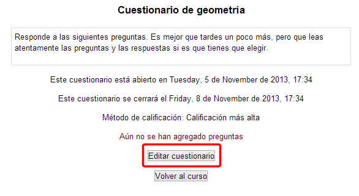
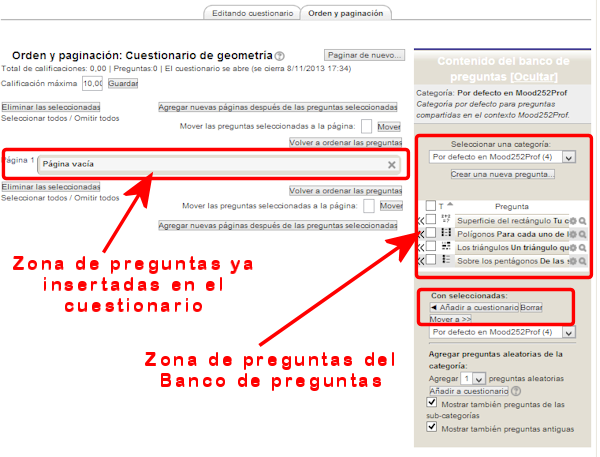
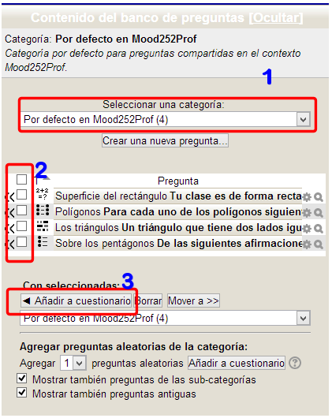
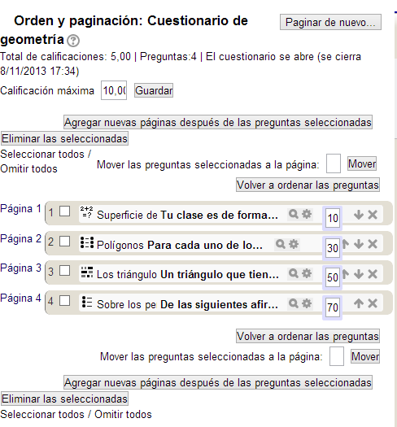

# Añadir preguntas a un cuestionario

Para añadir preguntas a un cuestionario debemos entrar en el cuestionario. Encontraremos el botón "**Editar cuestionario**", que nos llevará a la creación de preguntas del cuestionario:

**Fig. 5.39 Captura de pantalla. Vista de cuestionario**

 

Entraremos en la ventana de edición de las preguntas del formulario. En nuestro caso está todavía vacío:

**Fig. 5.40 Captura de pantalla. Edición de cuestionario**

 

Podemos insertar preguntas de las que tenemos guardadas en el Banco de Preguntas o podemos añadirlas directamente al cuestionario. Veamos el pimer caso:

En primer lugar elegimos la categoría de las preguntas para tenerlas en pantalla. Marcamos las que nos interesen y pulsamos en el botón Añadir a cuestionario: 

**Fig. 5.41 Captura de pantalla Contenido del banco de preguntas.**

 

Tras seleccionar las preguntas que queremos insertar(**1** y **2**) y pinchar después el botón **Añadir a cuestionario** (**3**). Las preguntas seleccionadas pasarán a formar parte del cuestionario.

**Fig. 5.42 Captura de pantalla. Preguntas del cuestionario.**

 

Cada una de ellas podremos verla, configurarla, moverla o quitarla del cuestionario.

El número que aparece con cada una de ellas (10, 20, 30 ...) corresponde al orden en el cuestionario. Les asigna números de 10 en 10 para permitir incluir entre una y otra preguntas adicionales.

 

## Tarea1

Añade a tu cuestionario algunas de las preguntas que has creado en el Banco de preguntas.
