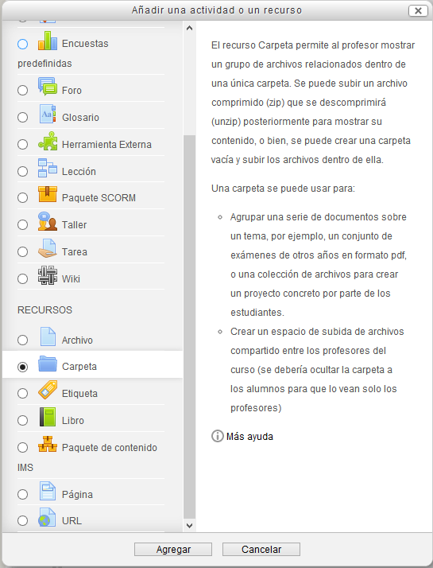
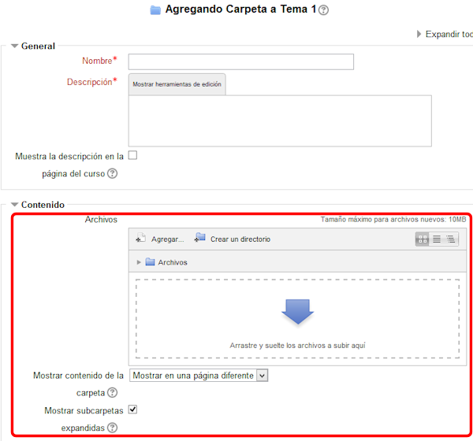

# Añadir una carpeta

Esta opción nos da la posibilidad de mostrar un gran número de archivos en un mismo documento.

En realidad, muestra todos los archivos que haya dentro de una de las carpetas del almacén.

**Fig. 3.64. Captura de pantalla de inserción de carpeta.**

 

Elegimos Carpeta y aceptamos para obtener la siguiente pantalla:

**Fig 3.65 Captura de pantalla de opciones de inserción de carpeta**

 

Como dice la descripción de la primera figura, podemos crear una carpeta e incluir en ella los archivos y subcarpetas que nos interesen, o podemos subir un archivo comprimido. Una vez subido puede descomprimirse como se ha explicado en el capítulo de [Opciones para archivos](opciones_para_archivos.html).

Más abajo podremos elegir si se muestra el contenido de la carpeta en una página diferente o se muestra el árbol de carpetas con el contenido en misma portada donde están los recursos del tema.

También podemos elegir si se han de mostrar las subcarpetas o no.

## Actividad 6

Utilizando el recurso Carpeta, añade varios archivos, al menos 3, que vayas a utilizar para tu módulo. Pueden ser imágenes, documentos, presentaciones.... material adicional que pueden utilizar tus alumnos para el estudio del tema o para realizar los trabajos. Preséntalos de forma que se vea el árbol de carpetas en la propia página de inicio.
