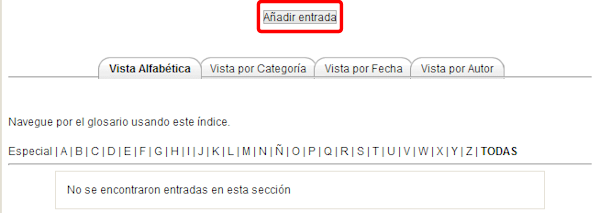
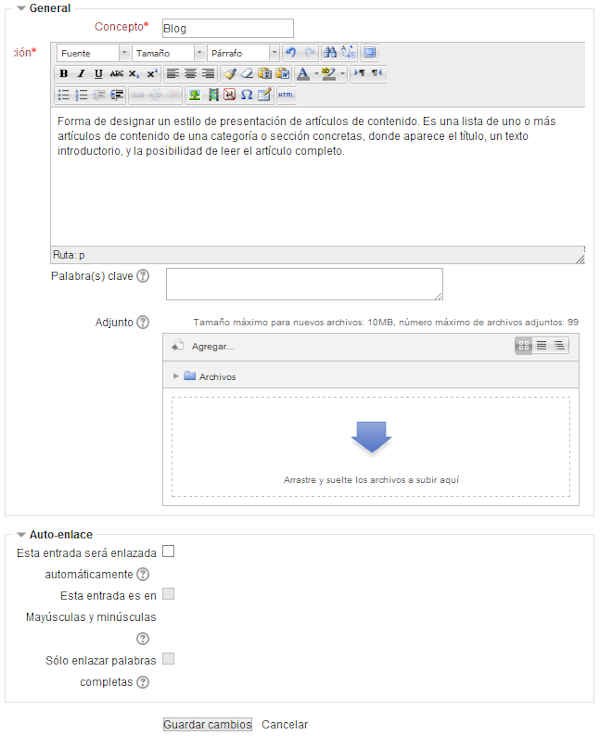
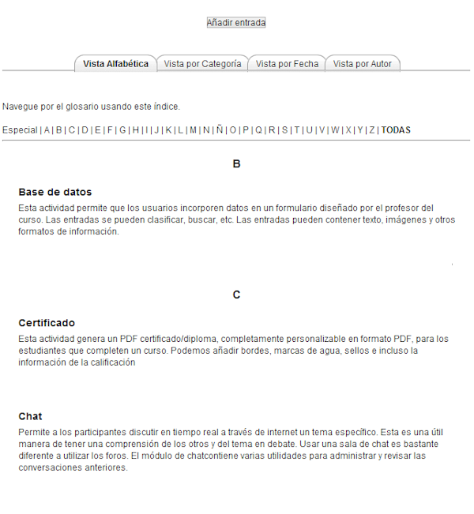

# Agregar entradas a un glosario

Una vez configurado un **glosario**, éste apararece con su icono correspondiente en el tema del curso donde lo hayamos creado: **Glosario**. También podemos verlo en el bloque **Actividades **entrando en Glosarios.

Para **agregar entradas,** pinchamos sobre él, apareciendo la ventana siguiente:

**Fig. 5.52 Captura de pantalla. Agregar entradas.**

 

Desde esta ventana se puede:

- **Buscar términos**.
- **Agregar entradas**.
<li>**Ver** el glosario de varias maneras:  
<ul>
- **Vista alfabética**: es la de la imagen
- **Vista por categoría**: si es que hemos introducido categorías
- **Buscar por fecha**: nos da las entradas por fecha en las que se las ha introducido el autor.
- **Buscar por autor**: nos da las entradas que ha efectuado una determinada persona.

Vamos a **agregar una entrada**, la definición de Blog, para ello se pincha en **Añadir entrada** y rellenamos el nombre y la definición:

**Fig. 5.53 Captura de pantalla. Opciones de una entrada.**

 

Hay otros campos de opciones para seleccionar:

- **Palabras clave: **Cada entrada del glosario puede tener asociada una lista de palabras clave o alias. Debe introducirse cada palabra o frase clave en una línea y sin separarlas por comas. Esto será útil si activamos el autoenlace.
- **Adjuntar un archivo**: Se pueden adjuntar archivos a cualquier entrada del glosario.
<li>**Autoenlaces**:
<ul>
- E**sta entrada será enlazada automáticamente:** Activando esta funcionalidad la entrada será automáticamente enlazada, en cuanto las palabras y frases del concepto aparezcan a lo largo del resto del curso. Esto incluye los mensajes en los foros, los materiales internos, resúmenes, diarios, etc. Para poder activar esta funcionalidad, el enlace automático debe estar activado a nivel de glosario.
- **Esta entrada es en Mayúsculas y minúsculas:** Esta variable especifica si las mayúsculas y minúsculas deben coincidir exactamente para crear el enlace automático a las entradas. Esta variable define si el enlace automático se hará con palabras completas o no.
- **Sólo enlazar palabras completas:** Si está habilitada, sólo enlazará automáticamente con palabras completas

Una vez configurada esta entrada, pinchamos en **Guardar **y ésta aparecera automáticamente en el **glosario**. Desde ahí podemos borrarla o editarla de nuevo.

A continuación tienes una imagen con un glosario de términos moodle:

**Fig. 5.54 Captura de pantalla. Vista de glosario.**

 

 
