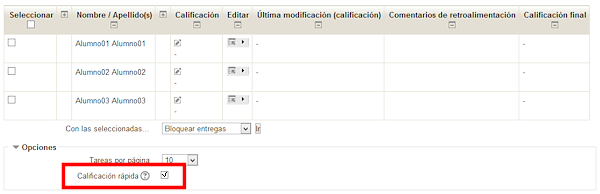
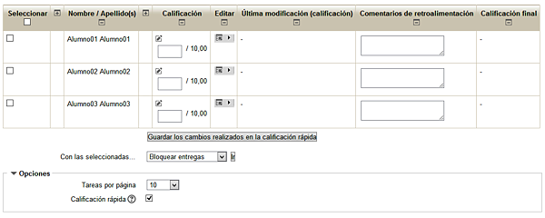

# Calificación rápida

La calificación de las tareas también puede configurarse con la opción Calificación rápida. Opción disponible en la parte inferior del calificador. Para ello, marca la casilla correspondiente y haz clic en el botón “Guardar preferencias”.

**Fig. 6.25 Captura de pantalla. Calificador.**

 

La vista del calificador con el modo de calificación rápida es la siguiente:

**Fig. 6.26 Captura de pantalla. Calificador con calificación rápida.**

 

El modo de calificación rápida te permite calificar las tareas sin necesidad de acceder a la pantalla de retroalimentación de cada uno de los alumnos/as. Puedes escribir un comentario directamente y activar la calificación pulsando sobre el icono que aparece en la columna **Editar**, y hacerlo de forma sucesiva con varios alumnos/as. Una vez realizadas las calificaciones será necesario guardar los cambios haciendo clic en el botón correspondiente.

 

 

## Tarea1

Activa la calificación rápida y accede a la calificación de algunas de las tareas. 

