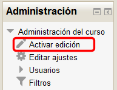
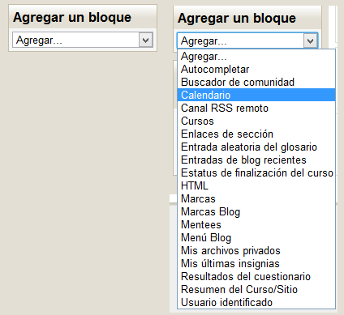
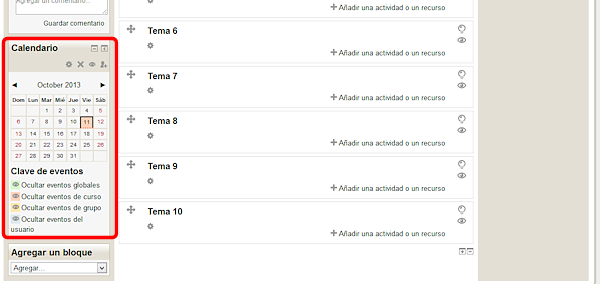
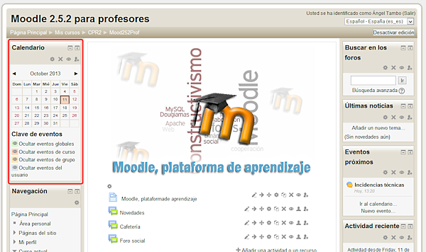

# Colocando bloques

Para añadir bloques en nuestra aula virtual, procederemos como se describe a continuación:

<ul>

</ul>
 
<ul>

</ul>
 
<ul>

</ul>
</li>

## Tarea1

¿Qué habrá que hacer para colocar el bloque **Calendario** en la esquina superior izquierda de nuestra aula virtual, tal como se muestra en la figura siguiente?:

**Fig. 2.17. Captura de pantalla de un curso en Moodle con el bloque calendario**

