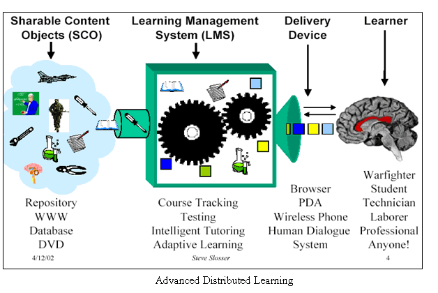

# Como aula virtual

|**Fig. 3.83 Obtenida de [Flickr](http://www.flickr.com/photos/13414078@N07/1371862876/sizes/o/in/photostream/). Galería de Microlearning Org.  Licencia CC Atribución**

Moodle puede utilizarse como aula virtual, tanto en formación a distancia como en formación presencial o semipresencial. Se puede construir un curso entero o utilizar el aula como apoyo a las clases presenciales.

En los siguientes módulos vas a aprender a crear actividades en Moodle, a generar herramientas de comunicación y a manejar un calificador para poder puntuar y llevar un registro de las actividades de tus alumnos.

Por esta razón, te invitamos a crear tu propia aula virtual.

Para darte una guía, puedes utilizar los tres primeros temas de la página, uno para cada evaluación. De momento, puedes ir incluyendo recursos en cada una de las evaluaciones y, poco a poco, conforme vayas avanzando, añadirás a tu aula actividades, herramientas de comunicación y un calificador.

Empieza creando las etiquetas y ya llegarán los contenidos...

En el apartado de **recursos**, bloque "Los proveedores", hemos hablado de eXeLearning, un gestor de contenidos para editar materiales en HTML, exportarlos como archivos comprimidos (IMS, SCORM) y subirlos a Moodle.

Aunque no lo tratemos con mucha profundidad, queremos terminar este módulo ofreciéndote la posibilidad de que aprendas a crear tus propios contenidos.

Como eXeLearning tiene un editor HTML semejante al de Moodle, podrás aprovechar lo aprendido para empezar a editar con este gestor de contenidos.

## Actividad 1

 

Esta actividad es importante porque con ella vas a generar la base sobre la que trabajarás en el resto de los módulos. Sobre lo que hagas ahora deberás añadir actividades, herramientas de comunciación y un calificador para poder evaluar. También añadirás usuarios y conocerás las modalidades de grupos que puedes utilizar en Moodle.

**Crea tres etiquetas: primera, segunda y tercera evaluación. **

Según la finalidad que busques, agrega recursos en cada una de las tres evaluaciones. De momento, incluye en cada evaluación una página web y enlaza dos archivos. Más adelante podrás cambiar, quitar o poner.

Ten presente que en los módulos y unidades anteriores has ido recopilando recursos. Puedes aprovecharlos. Pero muy posiblemente tendrás que reordenar el contenido, pero ya hemos visto que eso es muy sencillo.
