# Como catálogo de recursos

### Catálogo

También podría hablarse de expositor o repositorio. Nos referimos a la necesidad que a veces tiene un profesor de facilitar material a sus alumnos o quizá a otros profesores. Es cierto que también tenemos otras posibilidades para hacerlo, como enviar un archivo adjunto por correo electrónico, subirlo a una página web o repartir fotocopias, pero Moodle añade el valor de establecer una comunciación, de que podamos relacionarnos con los distintos usuarios que accedan a la plataforma, pedirles su opinión y darles la nuestra e incluso permitirles que sean ellos mismos los que añadan recursos.

Este catálogo pretende ser un instrumento de apoyo a las clases.

Vamos a tomar la estructura que hemos seguido para aprender a subir recursos a nuestro espacio educativo. Añadiremos algunos otros y las etiquetas necesarias.

Si pensamos en un profesor de **Lengua y Literatura**, que da clases de** Lengua Española** en 3º ESO y la optativa de **Procesos de Comunicación** en 4º ESO, podríamos habilitar un tema para cada nivel y albergar allí los recursos que queremos mostrar a nuestros alumnos.

## Materiales 3º ESO

Vamos a crear dos etiquetas dentro del mismo tema:

 

### 1. Lecturas.

### 2. Ortografía.

 

Tras la etiqueta de Lecturas vamos a añadir una página con indicaciones generales para la lectura.

**Fig. 3.69. Captura de pantalla. Inserción de página**

 

1. Para las** lecturas** hemos buscado en Google documentos en PDF de obras clásicas que están incluidas en la programación de 3º ESO:

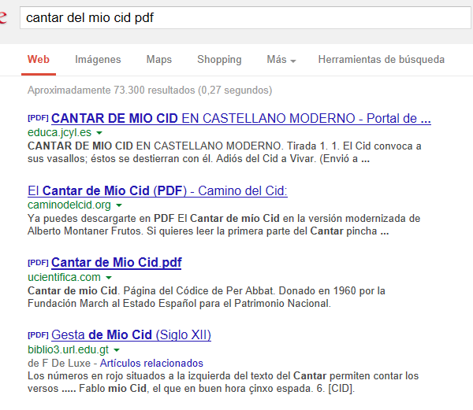

**Fig. 3.70 Captura de pantalla de búsqueda en Google.**

 

Guardamos el archivo en nuestro ordenador y lo subimos al sistema de archivos de Moodle.

Enlazamos el documento, utilizando la página de edición para el recurso **Enlazar un archivo o una web**:

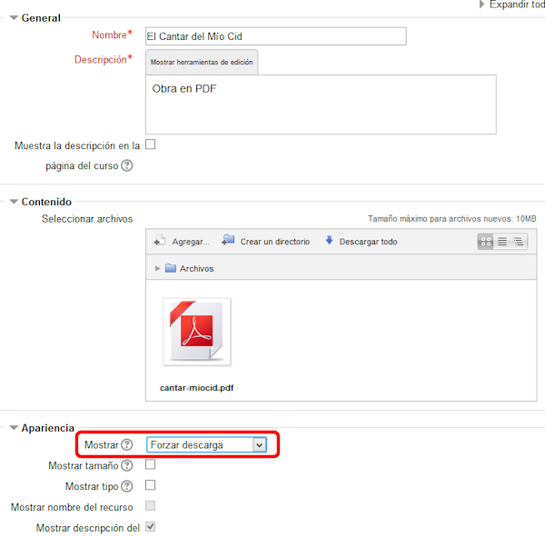

**Fig. 3.71 Captura de pantalla de Enlazar archivo o web**

 

Como queremos dar la posibilidad de que se descarguen un documento de nuestra página de Moodle, conviene que activemos **Forzar descarga**; así, al seleccionar el documento, se tendrá la doble opción de** Abrir** o **Guardar archivo:**

 

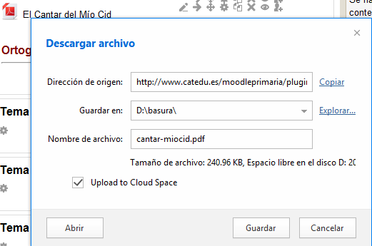

**Fig. 3.72 Captura de pantalla de descarga de archivo**

 

2. Para el apartado de **Ortografía **tenemos subido el archivo en PDF de la **Ortografía de la Lengua Española**, editada por la Real Academia Española, por el recurso de **Archivo** y también la web de Ortografía de la RAE.

Hemos elaborado una **página** con un ejercicio sobre ortografía y el aviso de cuándo y dónde se debe entregar hecho:

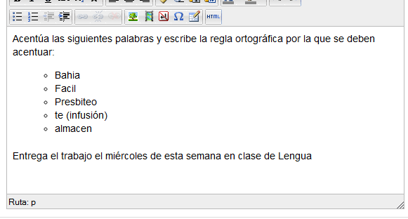

**Fig 3.73 Captura de pantalla del editor HTML para la inserción de una página**

 

El catálogo de materiales para 3º de ESO quedaría así:

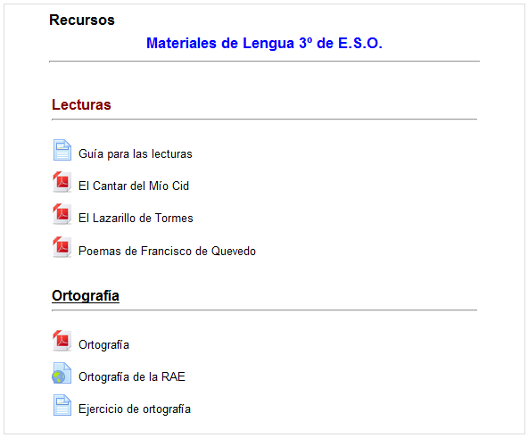

**Fig. 3.74 Captura de pantalla de aspecto de una parte del curso**

## Procesos de comunicación

Para esta asignatura quizá necesitemos tener accesibles algunos vídeos con fragmentos de películas.

También conviene disponer de la edición digital de algunos periódicos.

Tanto unos como otros podemos tenerlos a disposición utilizando el recurso **URL.** En este caso elegiríamos en la página de edición **Buscar una página web**:

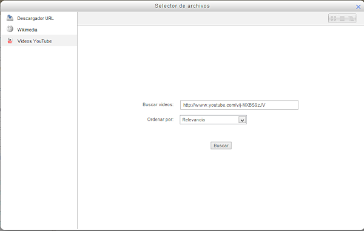

**Fig. 3.75 Captura de pantalla para la inserción de un recurso URL**

 

Una vez seleccionado volvemos a la página de inserción del recurso URL:

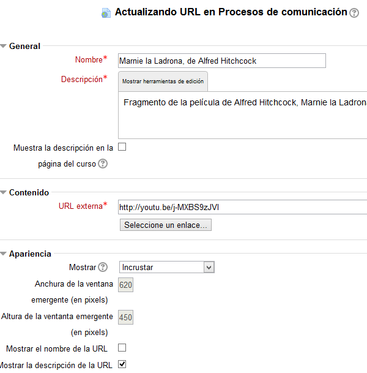

**Fig. 3.76 Captura de pantalla de inserción de URL**

 

En apariencia hemos optado por mostrarlo  en modo "Incrustar", para que nos lo presente en un reproductor del tamaño que se indica, en lugar de ponerlo a pantalla completa o en una ventana emergente.

 

Si queremos insertar un vídeo entre nuestros recursos, sería posible hacerlo copiando el **código embed **del vídeo y pegándolo como código HTML de una** página web**.

Debemos cuidar que el vídeo que descargamos tenga una licencia adecuada para ser compartido. En nuestro caso hemos elegido un cortometraje con licencia **Creative Commons **"atribución-no comercial-compartir igual" 3.0:

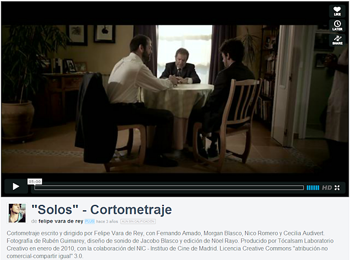

**Fig. 3.77 Captura de pantalla del vídeo en Vimeo**

 

El propio vídeo nos proporciona el código embed. 

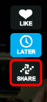

**Fig. 3.78 Captura de pantalla de iconos del vídeo en Vimeo**

 

Si hacemos clic en el icono SHARE, accedemos al código embed que tenemos que copia:

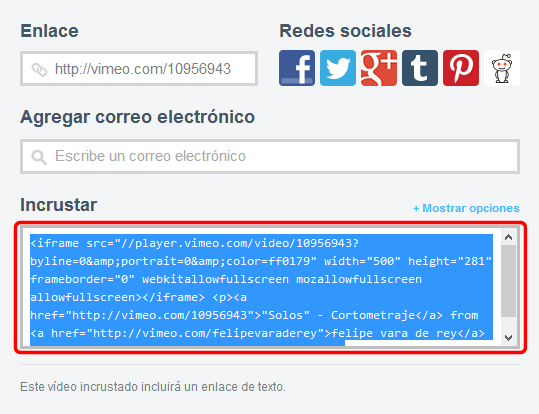

**Fig. 3.79 Captura de pantalla de opciones de compartir en Vimeo**

 

Lo copiamos y lo pegamos, abriendo el **código HTML** en nuestro recurso **Editar una página web**:

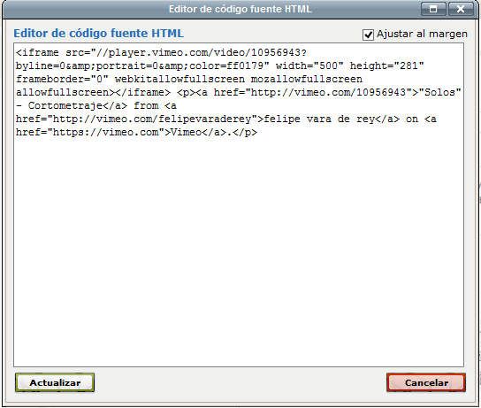

**Fig. 3.80 Captura de pantalla del código HTML del editor**

 

Si queremos volver a la vista normal, pulsamos el botón Actualizar.

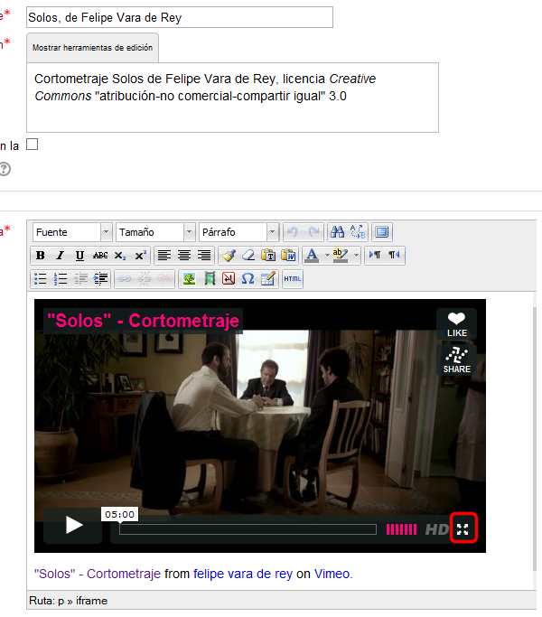

**Fig. 3.81 Captura de pantalla de edición de un recurso con un vídeo insertado en el editor**

 

Para verlo en pantalla completa, selecciona el icono que destacamos en la imagen.

Puedes ver el proceso de modo más dinámico en el siguiente videotutorial:

 

Los recursos que hemos preparado para **Procesos de comunicación**, quedarían así:

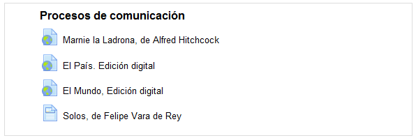

**Fig. 3.82 Captura de pantalla de una parte de la portada del curso**

 

 
