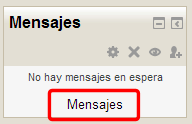
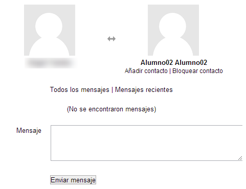
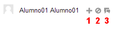
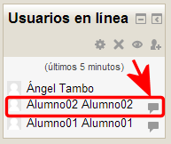
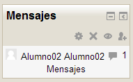

# Como usar la Mensajería

Podemos acceder a la mensajería por cualquiera de estos dos bloques, siempre y cuando haya algún usuario en línea. Si enviamos un mensaje a un usuario que está en línea este lo verá en tiempo real y puede contestarnos de la misma manera. Pero si el usuario al que enviamos el mensaje no está en línea, podrá recibir el mensaje en su dirección de correo electrónico personal, siempre y cuando la tenga habilitada en el curso (**ver perfil personal&gt;configuración**).

 

<ul>

<ul>

<li style="list-style-type: none;">
<ul>

 

### Usuario en línea

 

### **Aviso de mensajes pendientes**

Cuando el usuario no está en línea y recibe mensajes, estos quedan pendientes de leer. El sistema avisará de ello la siguiente vez que el usuario entre en el curso, indicando en el **bloque mensajes** cuántos mensajes se han recibido y qué usuarios los han enviado, como podéis ver en la imagen siguiente. Si activamos la opción ****recibir email cuando no estoy en línea****, recibiremos una copia de estos mensajes en nuestro correo personal. En el siguiente apartado veremos como hacerlo. 

**Fig. 4.64 Captura de pantalla. Bloque Mensajes**

## Actividad 12

Incluye a 10 estudiantes de tu curso en la **lista de contactos**.

**Envía mensajes** a dos de ellos y **bloquea** a otros dos.

