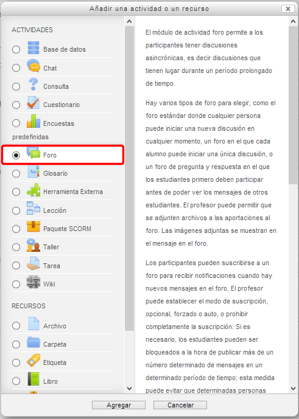
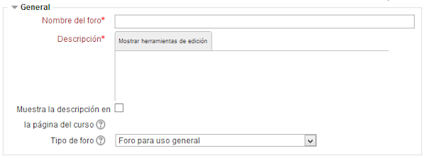
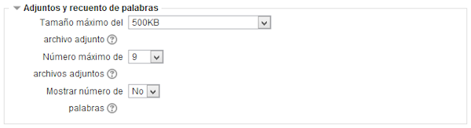
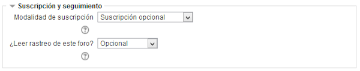
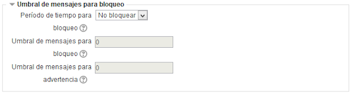
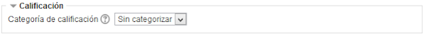
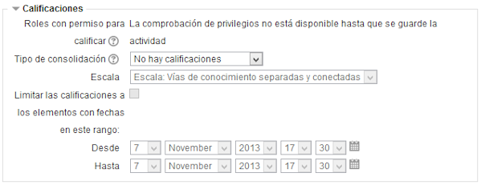
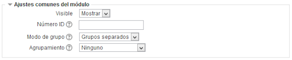

# Configuración de un foro

Al añadir un curso, se crea siempre un F**oro de novedades** sólo modificable por el docente (los alumnos/as solo pueden leer). Podemos utilizarlo para plantear preguntas, dinamizar actividades, debatir sobre temas concretos, etc.

Para añadir** un foro a un curso**, hemos de pinchar en el enlace **Añadir una actividad o un recurso** del tema correspondiente y elegir **Foro** en la ventana de elección de tipo de actividad**:**

**Fig. 5.57 Captura de pantalla. Ventana de inserción de un foro.**

 

Se abre un cuadro de diálogo con los apartados siguientes:

1. **General**
1. **Adjuntos y recuento de palabras**
1. **Suscripción y seguimiento**
1. **Umbral de mensajes para bloqueo**
1. **Calificación**
1. **Calificaciones**
1. **Ajustes comunes del módulo**

 

### **1. General**

**Fig. 5.58 Captura de pantalla. General.**

 

Hemos de rellenar los siguientes campos:

- **Nombre del foro:** aquí escribimos el nombre del foro: foro de presentaciones, foro de debate, foro temático, etc.
- **Descripción: **tecleamos una descripción sobre el uso del foro.
- **Muestra la descripción en la página del curso**: Marcas esta opción si queremos que la descripción del foro se vea también en la página inicial del curso.
- **Tipo de foro:** a elegir entre los tipos de foros que hemos comentado en el anterior capítulo.

 

### 2. Adjuntos y recuento de palabras

**Fig. 5.59 Captura de pantalla. Adjuntos y recuento de palabras.**

 

Tendremos que decidir sobre las siguientes cuestiones:

- **Tamaño máximo del archivo adjunto**, incluida la posibilidad de no admitir archivos adjuntos
- **Número máximo de archivos adjuntos**
- **Mostrar número de palabras**: donde se determina si se mostrará el número de palabras de los mensajes.

 

### 3. Suscripción y seguimiento

**Fig. 5.60 Captura de pantalla. Suscripción y seguimiento.**

 

La suscripción a los foros supone que el usuario suscrito recibe una copia de los mensajes a ese moro en su correo electrónico.

Hay que definir:

<li>**Modalidad de suscripción**: Determina cómo se van a suscribir los usuarios:
<ul>
- **Opcional**: Los usuarios pueden elegir si desean suscribirse o no.
- **Forzosa**: Todos están suscritos y no puede darse de baja.
- **Automática**: Todos están suscritos inicialmente pero cada usuario puede desactivar la suscripción en cualquier momento.
- **Desactivada**: No se permiten suscripciones.  

- **Opcional**: los alumnos pueden activar o desactivar el seguimiento a su discreción.
- **Conectado**: El seguimiento siempre está activo.
- **Desconectado**: El seguimiento siempre está inactivo.

 

### 4. Umbral de mensajes para bloqueo

**Fig. 5.61 Captura de pantalla. Umbral de mensajes para bloqueo.**

 

Consiste en **impedir a los usuarios enviar mensajes después que hayan enviado cierto número de ellos en un período determinado** y, conforme se aproximan a ese número, se les advertirá de que se están acercando al límite permitido. Si se desactiva el bloqueo, también se desactivarán las advertencias. **Ninguno de estos ajustes afecta a los mensajes enviados por los profesores/as**.

- **Período de tiempo para bloqueo**: Por defecto aparece "No bloquear". Podemos seleccionar bloquear desde **1 día hasta 1 semana**.
- **Umbrales de mensajes**: Si se ajusta el umbral de advertencia a cero se desactivarán los avisos, y si se ajusta el umbral de bloqueo a cero se desactivará el bloqueo.

 

### 5. Calificación

**Fig. 5.62 Captura de pantalla. Calificación.**

 

- **Categoría de la calificación**: Permite establecer a qué categoría del libro de calificaciones irán las correspondientes a esta actividad.

 

### 6. Calificaciones

**Fig. 5.63 Captura de pantalla. Calificaciones.**

 

- **Roles con permiso para calificar**: Esto realmente no es una opción, sino que informa de quiénes pueden calificar el glosario. Se establece en el enlace a **Permisos** del **Bloque Configuración**.
- **Tipos de consolidación**: Define cómo se toman las calificaciones para establecer la calificación global de la actividad. Si se elige "No hay valoraciones" la nota de esta actividad no aparecerá en el libro de calificaciones.
- **Escala**: Se pueden elegir escalas personales (creadas desde el enlace a Calificaciones del bloque Administración del curso) o numérica. Si elegimos un valor numérico, la calificación máxima no podrá superar el valor elegido.
- **Limitar las calificaciones a los elementos con fechas en este rango**: Las calificaciones se pueden restringir a un intervalo de tiempo.

 

### 7. Ajustes comunes del módulo

**Fig. 5.64 Captura de pantalla. Ajustes comunes del módulo.**

 

Aquí pueden cambiarse los ajustes predeterminados que tiene el módulo. Los cambios sólo afectarán a este foro.

 

Una vez rellenados todos los campos necesarios se **guardan** los cambios.

 

## Tarea1

Crea un foro para uso general en tu curso.
