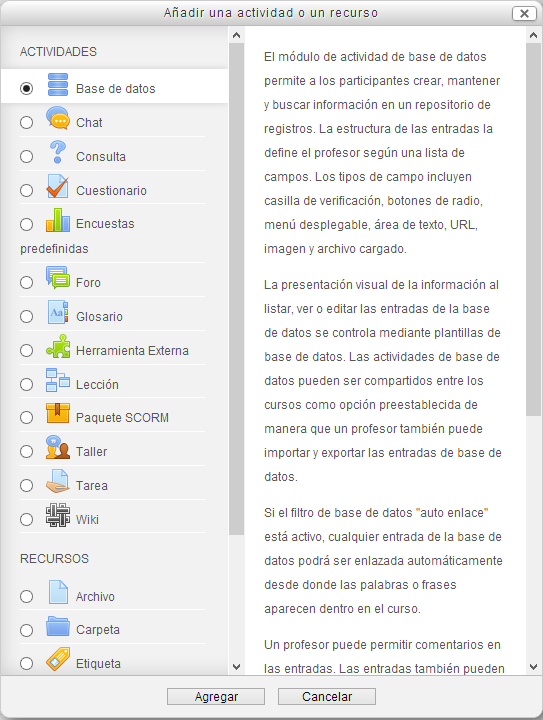

# Configuración de una base de datos

Para crear una **base de datos**, hemos de **activar la edición** y pulsar sobre el enlace Agregar una actividad o un recurso. En la ventana de elección de actividades seleccionamos **Base de datos**:

**Fig. 5.90 Captura de pantalla. Inserción de base de datos.**

 

Se abre un cuadro de diálogo con los siguientes campos:

1. **General**
1. **Entradas**
1. **Disponibilidad**
1. **Calificación**
1. **Calificaciones**
1. **Ajustes comunes al módulo**

Vamos a ver los campos a rellenar en los tres primeros puntos ya que el resto son comunes a otras actividades Moodle que ya hemos comentado..

 

### **1. General**

- **Nombre**: se pone un nombre a la base de datos.
- **Descripción: **Se describe lo que se pretende. En el ejemplo hemos escrito:

1.Busca un recurso educativo que te pueda ser útil para la materia que impartes.
2.Rellena la base de datos cumplimentando:

    - Tu nombre y apellidos.
    - Nombre del recurso aportado.
    - Dirección web del recurso.
    - Descripción: utilidad del recurso.

- **Muestra la descripción en la página del curso**: Determina si el enunciado puesto se verá en la página inicial del curso

### 2. Entradas

- **Aprobación requerida**: la selección Sí,permite a un profesor/a **aprobar las entradas** antes de que los estudiantes puedan verlas.
- **Permitir editar las entradas aprobadas**
- **Permitir comentar las entradas**: **permite que los usuarios hagan comentarios** a cada entrada.
- **Entradas requeridas**: Número de entradas que se exige enviar a cada participante. Se puede seleccionar desde **1 hasta 50 entradas**. Los usuarios verán un mensaje recordatorio que les informa si no han enviado el número de entradas exigido. La actividad no se considerará completada en tanto el usuario no haya enviado el número de entradas exigido.
- **Entradas requeridas antes de verse**:**Número de entradas que un participante debe enviar** antes de que se le permita ver cualquier entrada en esta actividad de la base de datos.
- **Nº Máximo de entradas**: **Número máximo de entradas que un participante puede enviar** en esta actividad.

### 3. Disponibilidad

- **Disponible desde y disponible hasta**: Habilitándolo podemos determinar en qué periodo de tiempo los alumnos pueden añadir datos a la base de datos
- **Solo lectura desde y Solo lectura hasta**: Habilitándolo establecemos entre qué periodo de fechas puede verse la base de datos, pero no modificarse.

Los demás apartados son similares a los que ya hemos visto.

Una vez configurada la base de datos **Guardamos los cambios.**
