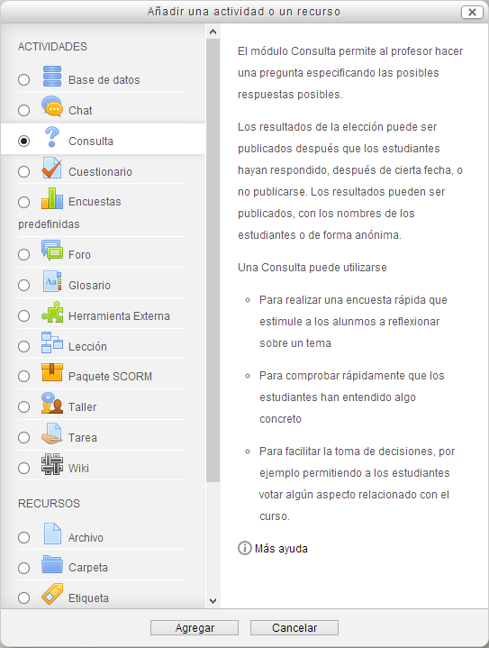
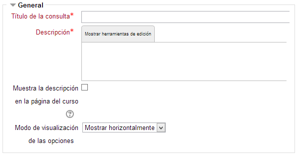
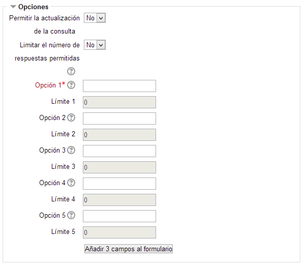
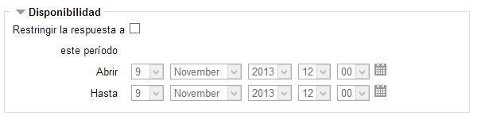
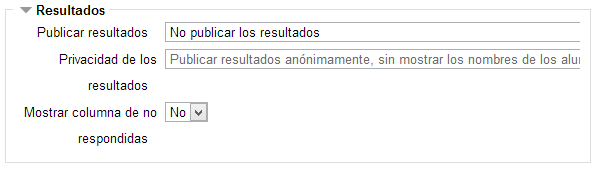

# Configuración de una consulta

Como en otras actividades, para añadir una Consulta debemos **Activar la edición** y, el el tema correspondiente del curso pulsar en el enlace "**Añadir una actividad o un recurso**". Aparecerá la ventana con la relación de actividades disponibles, en la que tendremos que elegir **Consulta**:

**Fig. 5.80 Captura de pantalla. Inserción de encuesta.**

 

Se abre un cuadro de diálogo con los apartados siguientes:

1. **General.**
1. **Opciones.**
1. **Disponibilidad.**
1. **Resultados**
1. **Ajustes comunes del módulo.**

 

### **1. General**

**Fig. 5.81 Captura de pantalla. General**

 

Aquí nos encontramos con los siguientes apartados a completar:

- **Título de la consulta**: ponemos la consulta.
- **Descripción: **una breve descripción de la consulta.
- **Muestra la descripción en la página del curso**: para determinar si la descripción se presentará en la página principal del curso
- **Modo de visualización de las opciones**: permite elegir cómo mostrar los resultados de la consulta, **horizontalmente o verticalmente**.

 

### **2. Opciones**

> 

**Fig. 5.82 Captura de pantalla. Opciones** 
 
<ul>
- **Permitir la actualización de la consulta**: Si se especifica que sí, le da al alumno la posibilidad de cambiar de opción, una vez ha respondido.
- **Limitar el número de respuestas permitidas**: Esta opción permite determinar si hay un límite de usuarios que pueden elegir cada una de las opciones de más abajo. Si se activa, habrá que especificar para cada opción cual es el límite.
- **Opción 1, 2, 3, 4, 5...**: tecleamos las opciones. El sistema nos da 5 por defecto pero se pueden añadir más haciendo clic en Agregar 3 campos al formulario.
</ul>

 

### 3. Disponibilidad

**Fig. 5.83 Captura de pantalla. Disponibilidad**

 

- Permite definir el **periodo de tiempo en el que los participantes pueden realizar su elección**. Se puede elegir fecha de apertura y cierre o establecer una fecha para abrir sin cerrar, para lo que deberemos establecer en el cierre una fecha muy, muy lejana.

 

### 4. Resultados

**Fig. 5.84 Captura de pantalla. Resultados.**

 

- **Publicar resultados:** permite seleccionar si los estudiantes verán los resultados publicados. Se puede elegir **no publicarlos** o bien que los** vean los estudiantes después de su respuesta**, **una vez cerrada la consulta o siempre**.
- **Privacidad de los resultados:** si en el campo anterior se selecciona **No publicar los resultados**, este campo estará inactivo. Si en el campo anterior se selecciona **publicar resultados** de cualquiera de sus tres formas, entonces este campo permite seleccionar entre que la **publicación sea anónima o no**.
- **Mostrar columna de no respondidas:** activando el **Sí**, se muestra una columna con respuestas no respondidas.

> 
<h3>** **</h3>

### **6. Ajustes comunes del módulo**

Es el mismo menú que en anteriores ocasiones.

## Tarea1

Diseña varias preguntas (o consultas) para generar al inicio de la sesión. Puedes generar la misma consulta para que la contesten al principio del tema y también al final del mismo para comprobar si hay diferencias en sus respuestas.
