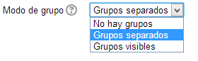

# Configuración modo grupos

Para establecer los grupos desde la **configuración general** **del curso** debemos acceder a la misma desde el **panel de administración** del en la opción **Editar ajustes**.

**Fig. 4.36 Captura de pantalla. Bloque Administración**

 

Una vez que se abre el panel debemos buscar ****grupos**** y en el menú desplegable del ****modo grupo******** encontraremos tres opciones:****

**Fig. 4.37 Captura de pantalla. Ajustes de grupo**

 

También podemos configurar estas opciones en **cada uno de los módulos** que configuran nuestro curso, aunque aquí no nos aparece la opción ****Forzar****. En este caso, la opción visible que aparece justo debajo del modo grupo, no tiene nada que ver con esto, sino con la **visibilidad o no de la tarea**. Si seleccionamos **mostrar**, los participantes del curso podrán verla. Ocurrirá lo contrario cuando optemos por la opción** no mostrar**.

Antes de ver qué ocurre con cada una de esas opciones y cómo podemos configurar nuestros grupos, vamos a analizar la otra opción que nos aparece, **forzar**. En este menú sólo tenemos dos posibilidades **Sí **o **No**.

- **Forzar**: Si optamos por esta opción, el modo de grupo que elijamos aquí **se aplicará **a todas las tareas, actividades o foros que pongamos en el curso, **con independencia de lo que indiquemos en cada uno de los módulos del curso**.  
- **No forzar** (recomendado): Sin embargo, si esta es la opción elegida (es la que aparece por defecto) el **modo de grupo** que determinemos en la configuración podrá ser modificada por el que establezcamos en algunos módulos del curso. Por ejemplo, si tenemos un curso de Historia para los estudiantes de 1º de la ESO de nuestro centro en el que hemos establecido tres grupos, puede que nos interese que cada uno de esos grupos sea completamente independiente de los demás. Para ello elegimos en la configuración general del curso la opción ****Grupos separados****. Si elegimos **Forzar&gt;Sí**, los estudiantes y el profesor/a de cada grupo no tendrán comunicación con (o de) los demás grupos. Pero si queremos, por ejemplo, que los foros sean comunes para que los miembros de todos los grupos intercambien información, debemos elegir la opción **Forzar&gt;No** y seleccionar en la configuración del foro ****Grupos visibles****, como puedes ver en la siguiente imagen.

De este modo **los miembros de todos los grupos pueden ver la actividad de los demás en el foro**, pero no necesariamente compartir otras tareas.

Analicemos entonces las implicaciones que en un curso puede tener seleccionar un **modo de grupo** u otro.

**Fig. 4.38 Captura de pantalla. Modos de grupo**

 

- ****No hay grupos****. Sólo debemos activar esta opción en el caso de que no establezcamos ningún grupo en el mismo. Si no tenemos grupos y activamos en una actividad las opciones **grupos separados** o **grupos visibles** los estudiantes no podrán participar en esa actividad, **ya que el sistema nos advertirá que no pertenecen a ningún grupo**. En este caso es preferible **forzar** la opción **no hay grupos** desde la configuración general.  
- ****Grupos separados****. Cuando hay grupos establecidos en el curso, esta es la opción más normal. Una de sus consecuencias es que las profesoras y profesores sólo vean las tareas realizadas o enviadas por los alumnos y alumnas de su grupo, pero no las de los demás. Si, como hemos dicho, no nos interesa que los estudiantes de los distintos grupos compartan ningún tipo de actividad, podemos ****forzar**** esta opción en la configuración general, pero si preferimos que todos los estudiantes con independencia de su grupo asignado participen en las actividades colaborativas (chats, foros, wikis,...) debemos dejar la opción **no forzar** en la configuración general y seleccionar **Grupos visibles** en las actividades que queramos que compartan todos los estudiantes. En la siguiente imagen podemos ver el panel de configuración de un foro.

- **Grupos visibles**. En este caso, los estudiantes y el profesorado de los diferentes grupos recibirán también la información de los demás. Podemos, como en el caso anterior, **no forzar** el modo grupo en la configuración general, para poder establecer **grupos separados** en algunas actividades concretas. Uno de los inconvenientes de los grupos visibles es que **pueden generar un gran tráfico de información** (que podrían llegar incluso a comprometer a nuestro servidor) entre los distintos agentes que participan en un curso (estudiantes, profesores/as, ...). Esto también dependerá de **cómo hayamos configurado en el perfil personal el uso del correo**. Volveremos a esta importante cuestión un poco más adelante, pues es muy recomendable que combinemos correctamente la configuración de ambos para evitar problemas de acceso al curso.

 

Los **agrupamientos por defecto** permite elegir el agrupamiento que interese para todos los módulos del curso salvo que en alguno de ellos se especifiquen otros grupos o agrupamientos.

 

Dos últimas cuestiones nos van a ocupar para terminar el módulo: **El perfil personal del usuario** y sus posibilidades de configuración y la **mensajería de Moodle**. Vamos allá.

## Pregunta Verdadero-Falso

### Pregunta 1

#### Sugerencia

<label for="true0b139"><input id="true0b139" name="option0b139" onclick="$exe.getFeedback(0,2,'0b139','truefalse')" type="radio"/> Verdadero</label>
<label for="false0b139"><input id="false0b139" name="option0b139" onclick="$exe.getFeedback(1,2,'0b139','truefalse')" type="radio"/> Falso</label>

#### Retroalimentación

**Falso**

### Pregunta 2

#### Sugerencia

<label for="true1b139"><input id="true1b139" name="option1b139" onclick="$exe.getFeedback(0,2,'1b139','truefalse')" type="radio"/> Verdadero</label>
<label for="false1b139"><input id="false1b139" name="option1b139" onclick="$exe.getFeedback(1,2,'1b139','truefalse')" type="radio"/> Falso</label>

#### Retroalimentación

**Verdadero**

### Pregunta 3

#### Sugerencia

<label for="true2b139"><input id="true2b139" name="option2b139" onclick="$exe.getFeedback(0,2,'2b139','truefalse')" type="radio"/> Verdadero</label>
<label for="false2b139"><input id="false2b139" name="option2b139" onclick="$exe.getFeedback(1,2,'2b139','truefalse')" type="radio"/> Falso</label>

#### Retroalimentación

**Verdadero**

### Pregunta 4

#### Sugerencia

<label for="true3b139"><input id="true3b139" name="option3b139" onclick="$exe.getFeedback(0,2,'3b139','truefalse')" type="radio"/> Verdadero</label>
<label for="false3b139"><input id="false3b139" name="option3b139" onclick="$exe.getFeedback(1,2,'3b139','truefalse')" type="radio"/> Falso</label>

#### Retroalimentación

**Falso**

### Pregunta 5

#### Sugerencia

<label for="true4b139"><input id="true4b139" name="option4b139" onclick="$exe.getFeedback(0,2,'4b139','truefalse')" type="radio"/> Verdadero</label>
<label for="false4b139"><input id="false4b139" name="option4b139" onclick="$exe.getFeedback(1,2,'4b139','truefalse')" type="radio"/> Falso</label>

#### Retroalimentación

**Verdadero**

## Actividad 7

Prueba las distintas formas de configurar el modo grupos.

1. Establece en la configuración general modo **grupos separados** y activa la **opción forzar** y comprueba si puedes modifcar el **modo grupos en un foro**.  
1. A continuación, **desactiva la opción forzar** y establece el modo grupo del foro como **visible**.  
1. Por último, establece la configuración del curso en el modo** no hay grupos** (activando la **opción forzar**) y, cambiando tu **rol** al de **estudiante**, trata de **colocar un tema** en el foro.

 
