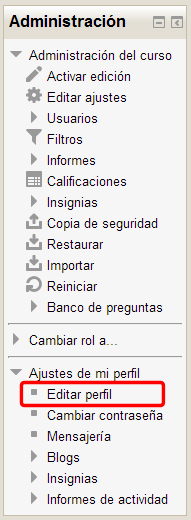
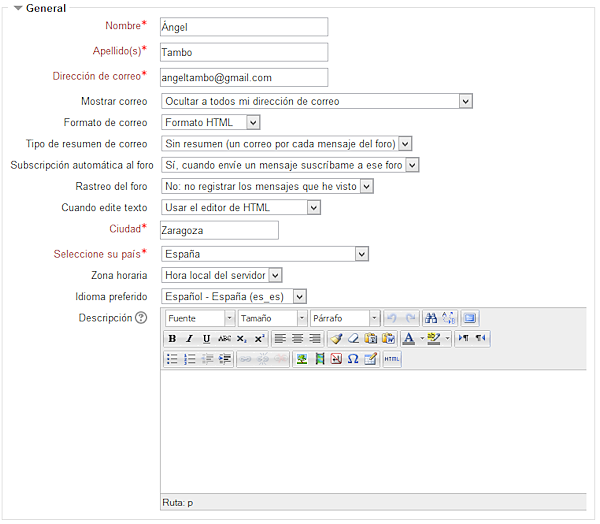
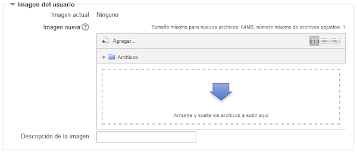
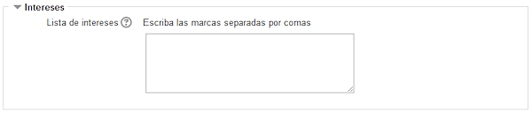

# Configurar Perfil

Para configurar la información que muestra nuestro perfil personal, la mayor parte de las cuestiones se resuelven mediante la opción ****Editar Perfil:****

**Fig. 4.41 Captura de pantalla. Bloque Administración**

 

En la ventana que se abre a continuación encontraremos las siguientes opciones ( te las vamos a mostrar en varias imágenes que muestran los distintos bloques):

- Como podéis ver, los **campos marcados en rojo**, son lo que Moodle solicita para activar a un usuario y son, por lo tanto, **imprescindibles**. Ya hemos visto que podemos ocultar nuestro correo electrónico a los demás usuarios, **pero no podemos quitar este dato**. Los demás datos no son obligatorios. Y, sin embargo, algunos datos son fundamentales, tanto para los estudiantes como para el profesorado.  

## Importante

Aunque consideramos muy interesante que **cada usuario del curso se identifique con una imagen**, ya que nos ayuda a aliviar la ****"soledad del navegante"**** y la frialdad de los cursos a distancia, tenemos que reiterar las necesarias precauciones que hay que tomar en el caso de** imágenes de menores en Internet** (es imprescindible el permiso paterno) y, si se usan imágenes que no son propias de cada uno, las **referentes a la propiedad intelectual**.

## Actividad 9

Entrando en la pestaña editar información de tu perfil personal, realiza los siguientes cambios:

1. Incluye una descripción con tu **perfil profesional**.  
1. **Oculta a todos** tu dirección de correo.  
1. En tipo de resumen de correo selecciona la opción **Completo (correo diario con mensajes completos)**.  
1. Selecciona **no autosucribirte a foros** y **sí registrar los mensajes ya vistos**.  
1. **Cambia tu imagen** (no tiene porque ser una fotografía tuya).
