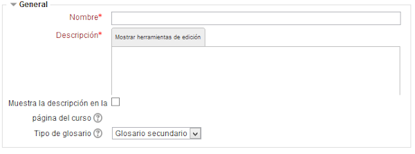
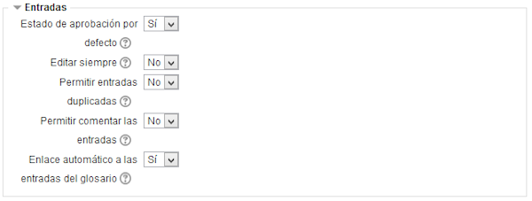
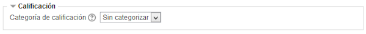
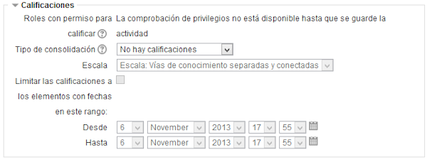
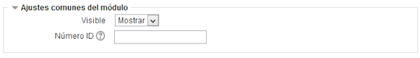

# Configurar un glosario

Vamos a ver cómo agregar un **glosario **en Moodle.

Hay que entrar en **Agregar una actividad o un recurso **(previamente hemos activado la edición): Buscamos ahí la opción **Glosario**:

**Fig. 5.45 Captura de pantalla. Inserción de glosario.**

 

Se abre un cuadro de diálogo con los apartados siguientes:

1. **Ajustes generales**
1. **Entradas**
1. **Apariencia**
1. **Calificación**
1. **Calificaciones**
1. **Ajustes comunes del módulo **

 

### **1. Ajustes generales**

Fig. 5.46 Captura de pantalla. General.

 

- **Nombre, **es obligatorio ponerlo.
- **Descripción: **Una descripción breve, es obligatoria.
- **Muestra la descripción en la página del curso**: Si esta casilla está activada, la descripción anterior se verá en la página principal del curso.
- **Tipo de glosario**: Aquí se determina si el glosario será principal o secundario. La diferencia está que sólo en un glosario principal se pueden importar entradas de otros glosarios. Sólo puede haber un glosario principal en un curso. Por contra, si no se desean importar entradas de otros, puede ser que todos los glosarios sean secundarios.

 

### 2. Entradas

**Fig. 5.47 Captura de pantalla. Entradas.**

 

- **Estado de aprobación por defecto**: Si elegimos No, las entradas requieren la aprobación de un profesor para que sean visibles por todos.
- **Editar siempre**: Se establece si las entradas pueden editarse por los alumnos en todo momento o, por el contrario, sólo tendrán un periodo de tiempo para hacerlo.
- **Permitir entradas duplicadas**: Se establece si puede haber varias entradas con el mismo nombre de concepto.
- **Permitir comentar las entradas**: Si se activa que sí, todos los usuarios con permiso para hacer comentarios podrán hacerlos a las entradas suyas o de otros.
- **Enlace automático a las entradas del glosario**: Si aparece que sí, al introducir una entrada, se vincularán automáticamente todas las palabras y frases iguales al concepto introducido en cualquier parte del curso.

 

### 3. Apariencia

**Fig. 5.48 Captura de pantalla. Apariencia.**

 

<li>**Formato de visualización de entradas**:Se puede elegir cómo se mostrará cada entrada dentro del glosario. Los formatos disponibles son:  
<ul>
- **Completo con autor**: Un formato semajante al de los foros, que **muestra la información del autor de cada entrada**. Los archivos adjuntos aparecen como enlaces.
- **Completo sin autor**: Un formato semajante al de los foros, que **no muestra la información del autor** de cada entrada. Los archivos adjuntos aparecen como enlaces.
- **Continuo sin autor**: Presenta las entradas una después de la otra sin otra separación que los iconos de separación.
- **Enciclopedia**: Semejante a "Completo con autor" pero en el que las imágenes adjuntas se muestran en línea.
- **FAQ: **Útil para presentar listas de **Preguntas Frecuentemente Respondidas**. Automáticamente añade las palabras **Pregunta** y **Respuesta** en el concepto y la definición respectivamente.
- **Lista de entradas**:
- **Simple, estilo diccionario**:Se ve como un diccionario convencional, con las entradas separadas. No se muestra a ningún autor y los archivos adjuntos aparecen como enlaces.

### **4. Calificación**

**Fig. 5.49 Captura de pantalla. Calificación**

 

- **Categoría de la calificación**: Permite establecer a qué categoría del libro de calificaciones irán las correspondientes a esta actividad.

 

### 5. Calificaciones

**Fig. 5.50 Captura de pantalla. Calificaciones**

 

- **Roles con permiso para calificar**: Esto realmente no es una opción, sino que informa de quiénes pueden calificar el glosario. Se establece en el enlace a **Permisos** del **Bloque Configuración**.
- **Tipos de consolidación**: Define cómo se toman las calificaciones para establecer la calificación global de la actividad. Si se elige "No hay valoraciones" la nota de esta actividad no aparecerá en el libro de calificaciones.
- **Escala**: Se pueden elegir escalas personales (creadas desde el enlace a Calificaciones del bloque Administración del curso) o numérica. Si elegimos un valor numérico, la calificación máxima no podrá superar el valor elegido.
- **Limitar las calificaciones a los elementos con fechas en este rango**: Las calificaciones se pueden restringir a un intervalo de tiempo.

 

### **3. Ajustes comunes del módulo**

**Fig. 5.51 Captura de pantalla. Ajustes generales del módulo.**

 

Visto ya en anteriores ocasiones.

 

Una vez configurado el glosario hay que guardarlo, pinchando en **Guardar cambios**.

## Tarea1

Configura un glosario en tu curso Moodle de manera que puedan añadir entradas los alumnos/as y tú puedas calificarlas.
