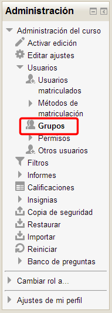
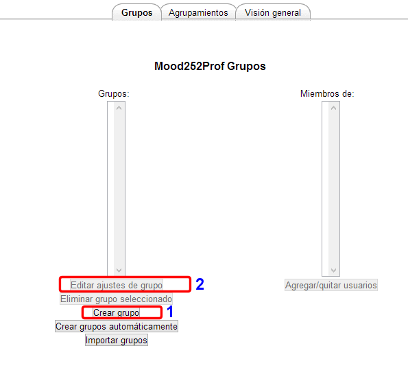
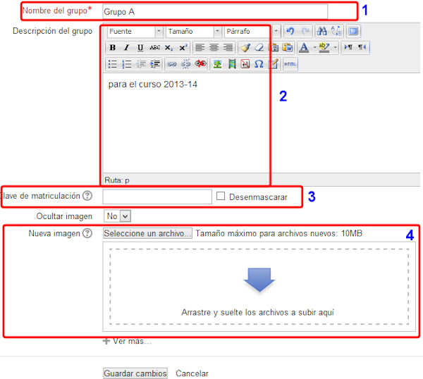
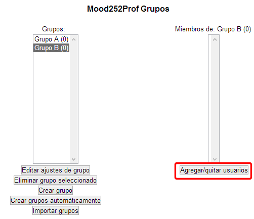
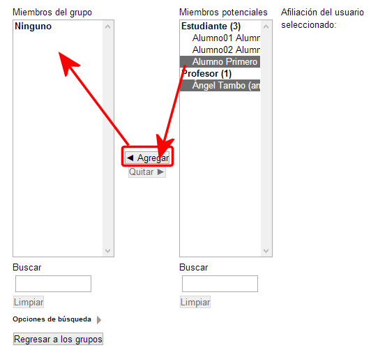
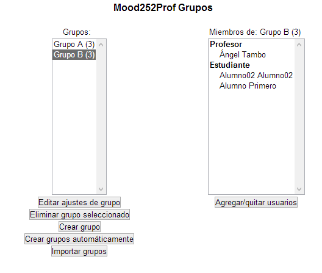
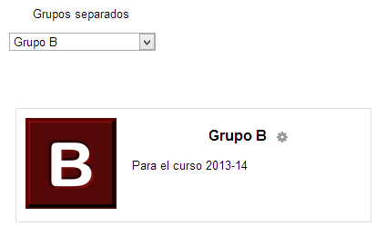

# Creación de grupos

Para **crear los grupos de nuestro curso**, debemos recurrir una vez más al panel de Administración del menú de la izquierda, activando en este caso la opción **Usuarios &gt;  grupos**.

**Fig. 4.26 Captura de pantalla. Bloque  Administración**

 

Una vez dentro del panel, veremos la siguiente imagen (en el caso de que en tu curso no haya grupos definidos previamente):

**Fig. 4.27 Captura de pantalla. Administración de grupos**

 

Lo primero que tenemos que hacer, una vez aquí, es crear los grupos que sean necesarios, pulsando el botón ****crear grupo (1). ****En la pantalla que se abrirá a continuación, podrás definir las características de cada curso, pero siempre podrás modificarlos pulsando el botón ****editar ajustes de grupo (2)****.

**Fig. 4.28 Captura de pantalla. Ajustes de grupo**

 

En esta pantalla podemos:

1. **Dar nombre al grupo**, por ejemplo, ****Grupo A****.
1. Incluir una pequeña **descripción** del mismo.
1. **Clave de matriculación**, en el caso de que deseemos que nuestros estudiantes tengan que conocer una clave para entrar en el curso. Recuerda marcar la casilla **"desenmascarar"** para asegurarte de que escribes bien la clave.
1. Por último, podemos **identificar** cada uno de nuestros **grupos** con una** imagen**, para lo que tendremos que arrastrarla hasta el selector de archivos y dejar la opción ocultar imagen como **no**. Esto es muy útil cuando, por ejemplo, en un foro, permitimos que participen varios grupos, pero queremos que los profesores puedan identificar rápidamente a los participantes de su curso.

No olvides, al finalizar este proceso, pulsar el botón **Guardar cambios** si estás conforme con lo que has hecho, o **Cancelar** si no quieres guardar los cambios.

Ahora, en nuestra pantalla inicial, aparecerá el grupo o grupos que hayamos ido creando en el cuadro de la izquierda, pero, como verás, no tienen usuarios asignados (es lo que se indica en el paréntesis (0)).

Para asignar a cada grupo el profesor/a y los estudiantes que correspondan, deberemos pulsar el botón **Agregar/quitar usuarios.**

**Fig. 4.29 Captura de pantalla. Administración de grupos**

 

**Fig. 4.30 Captura de pantalla. Asignación de alumnos a un grupos**

 

El procedimiento para agregar es el mismo que el que hemos visto para asignar roles: tenemos una casilla para **buscar participantes** y dos botones, uno para **agregar** usuarios y otro para **quitarlos** en el caso de que nos hayamos equivocado. No olvides agregar también al profesor/a. Una vez que pulses el botón **Regresar a los grupos **verás este resultado:

**Fig. 4.31 Captura de pantalla. Administración de grupos**

 

Encontrarás cada uno de los grupos que hayas creado, con el **profesor/a** en primer lugar y los **estudiantes** que hayas incluido en ese grupo.

También puedes usar la **vista general** que tienes en la pestaña superior. De esta manera podrás ver todos tus cursos con sus miembros a la vista.

Si ahora vas al **panel de participantes** y seleccionas uno de los grupos, verás, además del listado de miembros, todo lo que hayas añadido: **nombre, descripción, imagen,...**

**Fig. 4.32 Captura de pantalla. Detalle de grupo**

 

Encontrarás una explicación breve de todo esto en el siguiente vídeo tutorial.

## Actividad de Espacios en Blanco

Completa el siguiente texto rellenando los huecos con las palabras correspondientes:

 

En la pantalla de crear grupo o editar ajustes de grupo podemos: 

<li><b>Dar  
<label class="sr-av" for="clozeBlank133_22.0">Rellenar huecos (1):</label>
<input class="autocomplete-off" id="clozeBlank133_22.0" style="width:6em" type="text" value=""/>
JXUwMDM2JXUwMDAxJXUwMDAyJXUwMDBmJXUwMDEwJXUwMDE3

  al  
<label class="sr-av" for="clozeBlank133_22.1">Rellenar huecos (2):</label>
<input class="autocomplete-off" id="clozeBlank133_22.1" style="width:5em" type="text" value=""/>
JXUwMDNmJXUwMDE1JXUwMDA3JXUwMDA1JXUwMDFm

</b>, por ejemplo, ***1º A***.</li>
<li>Incluir una pequeña  
<label class="sr-av" for="clozeBlank133_22.2">Rellenar huecos (3):</label>
<input class="autocomplete-off" id="clozeBlank133_22.2" style="width:11em" type="text" value=""/>
JXUwMDNjJXUwMDAxJXUwMDE2JXUwMDEwJXUwMDExJXUwMDFiJXUwMDE5JXUwMDEzJXUwMDBhJXUw
MDlhJXUwMDlk

  del mismo.</li>
<li><b>
<label class="sr-av" for="clozeBlank133_22.3">Rellenar huecos (4):</label>
<input class="autocomplete-off" id="clozeBlank133_22.3" style="width:5em" type="text" value=""/>
JXUwMDFiJXUwMDJmJXUwMDBkJXUwMDE3JXUwMDEz

  de  
<label class="sr-av" for="clozeBlank133_22.4">Rellenar huecos (5):</label>
<input class="autocomplete-off" id="clozeBlank133_22.4" style="width:13em" type="text" value=""/>
JXUwMDM1JXUwMDBjJXUwMDE1JXUwMDA2JXUwMDFiJXUwMDBhJXUwMDE2JXUwMDE5JXUwMDBkJXUw
MDAyJXUwMDBhJXUwMDlhJXUwMDlk

</b>,
	en el caso de que deseemos que nuestros estudiantes tengan que conocer
	una clave para entrar en el curso. Recuerda marcar la casilla  
<label class="sr-av" for="clozeBlank133_22.5">Rellenar huecos (6):</label>
<input class="autocomplete-off" id="clozeBlank133_22.5" style="width:13em" type="text" value=""/>
JXUwMDNjJXUwMDAxJXUwMDE2JXUwMDE2JXUwMDBiJXUwMDAzJXUwMDBjJXUwMDEyJXUwMDEwJXUw
MDAyJXUwMDEzJXUwMDEzJXUwMDEz

  para asegurarte de que escribes bien la clave.</li>
<li>Por último, podemos  
<label class="sr-av" for="clozeBlank133_22.6">Rellenar huecos (7):</label>
<input class="autocomplete-off" id="clozeBlank133_22.6" style="width:11em" type="text" value=""/>
JXUwMDMxJXUwMDBkJXUwMDAxJXUwMDBiJXUwMDFhJXUwMDFkJXUwMDBmJXUwMDBmJXUwMDBhJXUw
MDAyJXUwMDEz

  cada uno de nuestros  
<label class="sr-av" for="clozeBlank133_22.7">Rellenar huecos (8):</label>
<input class="autocomplete-off" id="clozeBlank133_22.7" style="width:6em" type="text" value=""/>
JXUwMDNmJXUwMDE1JXUwMDA3JXUwMDA1JXUwMDFmJXUwMDFj

  con una<b>
<label class="sr-av" for="clozeBlank133_22.8">Rellenar huecos (9):</label>
<input class="autocomplete-off" id="clozeBlank133_22.8" style="width:6em" type="text" value=""/>
JXUwMDMxJXUwMDA0JXUwMDBjJXUwMDA2JXUwMDAyJXUwMDBi

</b>, para lo que tendremos que seleccionarla con el botón  
<label class="sr-av" for="clozeBlank133_22.9">Rellenar huecos (10):</label>
<input class="autocomplete-off" id="clozeBlank133_22.9" style="width:8em" type="text" value=""/>
JXUwMDNkJXUwMDFkJXUwMDE5JXUwMDBjJXUwMDA0JXUwMDA3JXUwMDBmJXUwMDEz

  y dejar la opción ocultar imagen como **no**.
	Esto es muy útil cuando, por ejemplo, en un foro, permitimos que
	participen varios grupos, pero queremos que los profesores puedan
	identificar rápidamente a los participantes de su curso.</li>

<input class="button" id="submit133_22" name="submit133_22" type="submit" value="Enviar"/>
<input id="restart133_22" name="restart133_22" onclick="$exe.cloze.restart('133_22')" style="display:none" type="button" value="Reiniciar"/>
<input id="showAnswersButton133_22" name="133_22showAnswersButton" onclick="$exe.cloze.fillInputs('133_22')" style="display:none" type="button" value="Mostrar las respuestas"/>
Habilitar JavaScript

## Actividad 5
