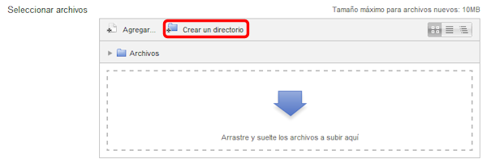
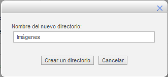
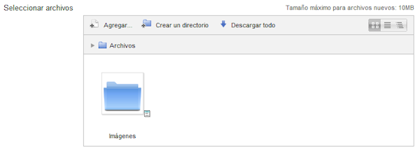

# Crear una carpeta

En nuestra sección de Archivos privados o cuando vamos a incluir una carpeta o archivo a uno de los temas nos presenta el "Selector de archivos", que nos permitirá, entre otras cosas, crear carpetas o directorios en ese espacio en particular.

**Fig. 3.4 Captura de pantalla. Selector de archivos**

 

Dentro de las carpetas se pueden crear otras, obteniéndose así un árbol de carpetas similar a lo que tenemos en el Explorador de Archivos de Windows.

La creación de la carpeta o directorio es tan sencillo como pulsar en el botón correspondiente, con lo que nos aparecerá la opción de asignar nombre a la nueva carpeta:

**Fig. 3.5 Captura de pantalla. Ventana de introducción de nombre de carpeta**

 

Pulsando después en el botón "Crear un directorio", la carpeta aparecerá en el selector de archivos:

**Fig. 3.6 Captura de pantalla, Selector de archivos con carpeta creada**

 

Especialmente en el arpartado de Archivos privados, es muy importante mantener ordenados los archivos mediante una estructura de carpetas racional y clara. En caso contrario, encontrar un archivo concreto, si se tienen muchos, puede resultar tedioso.

## Actividad 1: Crear un directorio

 

Piensa en qué archivos vas a necesitar en tu espacio personal de Archivos privados y piensa también en cómo los puedes organizar. Crea al menos tres carpetas en él.
