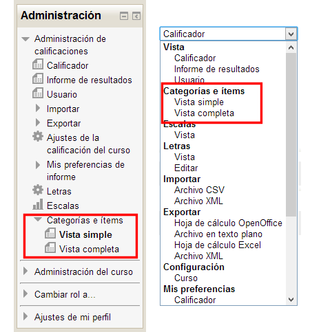
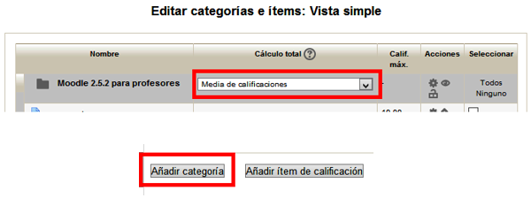
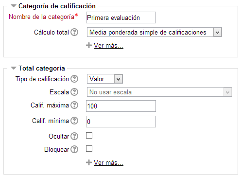
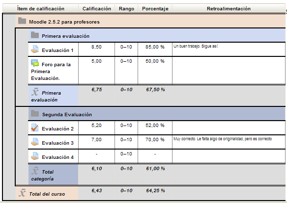

# Crear y asignar categorías

A continuación vamos a ver cómo crear y asignar categorías en un curso. 

Para crear una categoría de calificación:

Entra al calificador y desde allí accede a la opción **Categorías e ítems-Vista simple**, como hemos visto para los ítems en la unidad anterior:

**Fig. 6.32 Captura de pantalla. Acceso a categorías de calificación**

 

Configura el curso para que las calificaciones finales sean resultado de hacer la media entre todas notas de cada evaluación y a continuación haz clic en el botón "Añadir categoría" que puedes ver en la parte inferior de la página.

**Fig. 6.33 Captura de pantalla. Editar categorías e ítems.**

 

Pon un nombre a la categoría de calificación y establece los ajustes apropiados a la categoría que has creado. Pinchando en los enlaces "**Ver más...**" podrás ver más opciones para cada uno de los bloques de configuración. Cuando termines haz clic en el botón "Guardar los cambios". Observa la imagen siguiente: 

**Fig. 6.34 Captura de pantalla. Opciones para Categoría de calificación**

 

- **Nombre de categoría**: Para poner un nombre que la identifique en el libro de calificaciones.
- **Cálculo total**. Definimos aquí cómo se va a calcular la calificación de la categoría sobre la base de los elementos que la integran.
- **Tipo de calificación**. Valor, si se va a utilizar la calificación numérica. Escala, si se va a usar una escala cualitativa. Aunque en rigor no es necesario, para ser coherentes lo más sencillo es elegir el tipo de calificación que se haya aplicado en los elementos que vamos a integrar en la categoría.
- **Escala**. Si se ha seleccionado como tipo de calificación Escala, seleccionaremos aquí la escala a aplicar.
- **Calif. máxima y mínima**: Para definir qué rango de valores tendrá la calificación global de la categoría.
- **Ocultar**: Para ocultar a los alumnos las calificaciones de los items que pertenezcan a esta categoría.
- **Bloquear**: La calificación de los items que pertenezcan a esta categoría no podrán modificarse.

Hay más opciones ocultas que aparecerán pulsando en el correspondiente enlace "**Ver más...**" de cada uno de los bloques.

Si, al crear una nueva categoría, ya había otra u otras creadas antes, parecerá una nueva opción que permitirá convertirla directamente en subcategoría de una de las anteriores. Por defecto se crea como subcategoría de la categoría general del curso.

Después no tenemos más que pinchar en el botón **Guardar cambios**.

Las categoría creadas aparecerán vacías. Tendremos que incluir en ellas los items de evaluación que les correspondan:

**Fig. 6.35 Captura de pantalla. Categorías de calificación**

 

Para ello hemos marcado las que nos interesaban y, bajo la lista de items hemos elegido en el desplegable la categoría en la que queremos incluirlos. Repetimos el proceso con todos los items que queremos incluir en una categoría. Así quedaría nuestro curso tras la creación de dos categorías:

**Fig. 6.36 Captura de pantalla. Categorías de calificación**

 

## Tarea1

Crea tres categorías para tu curso que se llamen Primera, segunda y tercera evaluación. A continuación asigna a cada evaluación las tareas correspondientes.

Moodle calculará de forma automática cada una de las puntuaciones obtenidas y así lo reflejará en el calificador del alumno/a:

## Tarea1

Edita y asigna a cada tarea la puntuación que consideres más idónea teniendo en cuenta que para cada evaluación debes configurar como estrategia de calificación la media ponderada y como calificación final para el curso el resultado de hacer la media aritmética entre las tres evaluaciones.

## Pregunta Verdadero-Falso

### Pregunta 1

#### Sugerencia

<label for="true0b101"><input id="true0b101" name="option0b101" onclick="$exe.getFeedback(0,2,'0b101','truefalse')" type="radio"/> Verdadero</label>
<label for="false0b101"><input id="false0b101" name="option0b101" onclick="$exe.getFeedback(1,2,'0b101','truefalse')" type="radio"/> Falso</label>

#### Retroalimentación

**Falso**

### Pregunta 2

#### Sugerencia

<label for="true1b101"><input id="true1b101" name="option1b101" onclick="$exe.getFeedback(0,2,'1b101','truefalse')" type="radio"/> Verdadero</label>
<label for="false1b101"><input id="false1b101" name="option1b101" onclick="$exe.getFeedback(1,2,'1b101','truefalse')" type="radio"/> Falso</label>

#### Retroalimentación

**Verdadero**

