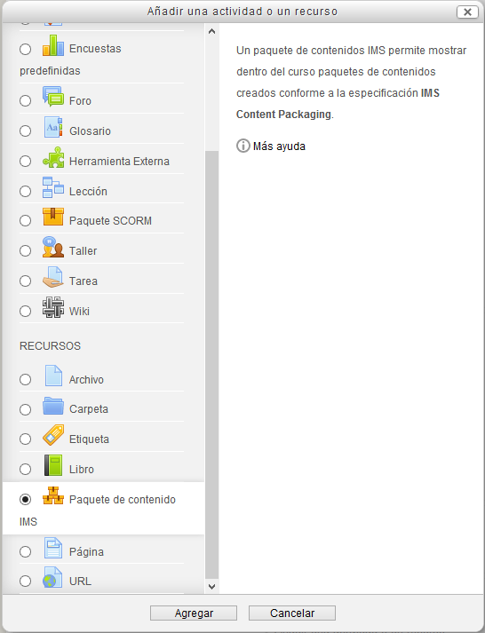
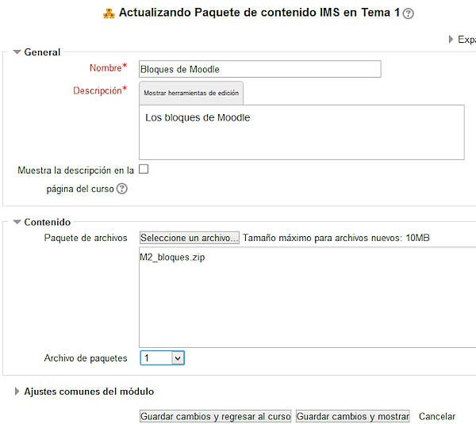

# Desplegar paquete de contenido IMS

Antes de aprender cómo podemos desplegar un paquete de contenido IMS, vamos a conocer, de modo sencillo, qué es y para qué se utiliza.

Las siglas corresponden a [****I**nstructional **M**anagement **S**ystems**](http://www.imsglobal.org/content/packaging/index.html) y, en principio, la denominación completa del producto era **IMS Content Packaging**, "un formato digital estándar para representar paquetes de contenidos educativos" (ver [enlace](http://ares.cnice.mec.es/informes/16/contenido/13.htm)).

Esos "paquetes de contenidos" pueden generarse con distintas herramientas web, como los gestores de contenidos. La característica común es que "define explícitamente la estructura de un conjunto de archivos con contenidos educativos interrelacionados" (ver [enlace](http://ares.cnice.mec.es/informes/16/contenido/13.htm)).

Para crear este material estamos utilizando el gestor de contenidos [eXeLearning](http://exelearning.org/wiki), que genera paquetes IMS, que luego desplegamos en Moodle.

Te ofrecemos la posibilidad de aprender a crear tus propios documentos con eXeLearning y de explortarlos como IMS en el bloque "Aplicaciones prácticas", pero, de momento, sólo vamos a utilizar  los IMS generados a partir de él, para ilustrar este apartado.

Un paquete IMS tiene un formato comprimido .zip y se sube al almacén como cualquier otro archivo.

Seguimos el camino ya conocido: activar edición, Añadir una actividad o un recurso, **paquete de contenidos IMS**.

**Fig 3.66 Captura de pantalla de inserción de Paquete de contenido**

 

Aceptando nos presenta la siguiente pantalla

**Fig 3.67 Captura de pantalla de opciones de inserción de paquete de contenido.**

 

en la que ya hemos puesto el contenido. Hemos añadido un paquete IMS que se llama M2_bloque.zip como se ha visto en varias ocasiones antes.

Al guardar los cambios tendremos disponible y desplegado el paquete IMS en cuestión.

## Pregunta de elección múltiple

### Pregunta

¿Qué es IMS Content Packaging ?

#### Respuestas

<label class="sr-av" for="i62_5">[Opción 1](#answer-62_5)</label><input id="i62_5" name="option62_2" onclick="$exe.getFeedback(0,3,'62_2','multi')" type="radio"/>

Un programa de ordenador.

<label class="sr-av" for="i62_38">[Opción 2](#answer-62_38)</label><input id="i62_38" name="option62_2" onclick="$exe.getFeedback(1,3,'62_2','multi')" type="radio"/>

Un formato digital.

<label class="sr-av" for="i62_41">[Opción 3](#answer-62_41)</label><input id="i62_41" name="option62_2" onclick="$exe.getFeedback(2,3,'62_2','multi')" type="radio"/>

Un gestor de contenidos.

#### Retroalimentación

Incorrecto.

Correcto.

Incorrecto.

#### Solución

1. [Incorrecto](#answer-62_5) ([Retroalimentación](#sa0b62_2))
1. [Opción correcta](#answer-62_38) ([Retroalimentación](#sa1b62_2))
1. [Incorrecto](#answer-62_41) ([Retroalimentación](#sa2b62_2))

### Pregunta

¿Qué es eXelearning?

#### Respuestas

<label class="sr-av" for="i62_47">[Opción 1](#answer-62_47)</label><input id="i62_47" name="option62_44" onclick="$exe.getFeedback(0,3,'62_44','multi')" type="radio"/>

Un procesador de textos.

<label class="sr-av" for="i62_50">[Opción 2](#answer-62_50)</label><input id="i62_50" name="option62_44" onclick="$exe.getFeedback(1,3,'62_44','multi')" type="radio"/>

Un paquete de contenidos.

<label class="sr-av" for="i62_53">[Opción 3](#answer-62_53)</label><input id="i62_53" name="option62_44" onclick="$exe.getFeedback(2,3,'62_44','multi')" type="radio"/>

Un gestor de contenidos.

#### Retroalimentación

Incorrecto.

Incorrecto.

Correcto.

#### Solución

1. [Incorrecto](#answer-62_47) ([Retroalimentación](#sa0b62_44))
1. [Incorrecto](#answer-62_50) ([Retroalimentación](#sa1b62_44))
1. [Opción correcta](#answer-62_53) ([Retroalimentación](#sa2b62_44))
