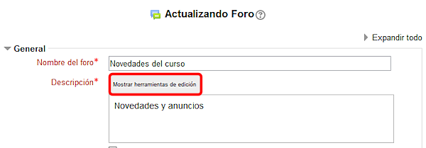
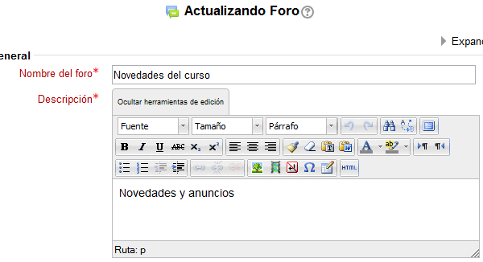

# Editor HTML

El editor HTML Richtext ofrece una interfaz semejante a un procesador de textos y te permite generar código HTML, aunque no conozcas ese lenguaje.

Se tiene acceso a él al crear o actualizar cualquier actividad. Al entrar en la creación o actualización encontraremos una pantalla similar a esta:

**Fig. 3.25 Captura de pantalla.Editor HTML. **

Está listo para incluir texto sin ningún formato especial en la Descripción, en este caso. Si pulsamos sobre la pestaña "Mostrar herramientas de edición" obtendremos el editor con las herramientas que pone a nuestra disposición para dar formato al texto. Algo así:

**Fig. 3.26 Captura de pantalla. Editor HTML**

En el editor de texto encontramos los siguientes botones:

**Fila superior**:

- Encontramos tres desplegables para elegir: **fuente, tamaño de la fuente y formato.**
- Deshacer y rehacer
- Buscar y Buscar/reemplazar
- Cambiar a modo de pantalla completa

**Segunda fila**:

- Puedes elegir entre **negrita**, **cursiva**, subrayado, tachado subíndice o superíndice. 
- Alineación izquierda, centrada o derecha
- Limpiar código basura, borrar formato, pegar como texto plano y pegar desde Word.
- Color del texto y color del fondo
- Dirección de izquierda a derecha y dirección de derecha a izquierda

**Tercera fila:**

- Lista desordenada, lista ordenada, reducir sangría y aumentar sangría
- Insertar/editar hipervínculo, quitar hipervínculo y evitar vínculos automáticos
- Insertar/editar imagen, insertar/editar medio embebido, insertar carácter de espacio 'non-breaking', insertar caracteres personalizados, LaTeX a Match, Insertar una nueva tabla
- Editar código HTML

 

El símbolo de Word que encuentras a continuación se utiliza para borrar el código erróneo que entra en el editor cuando copiamos desde el procesador de textos Word.

Las flechas azules del final son para deshacer o rehacer la última acción, como en cualquier procesador de textos.

Entre tantas posibilidades veremos algunas, de uso frecuente y que pueden presentar ciertas dificultades, en los recursos que te presentamos a continuación.
