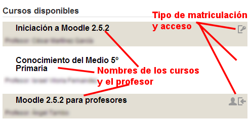
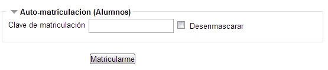
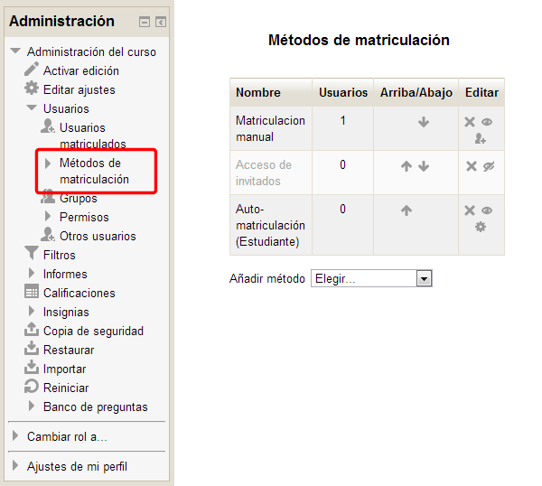

# El alumno puede matricularse por sí mismo

### Opción A: El alumno puede matricularse por si mismo  

Cuando un alumno/a entra a la plataforma Moodle, encuentra en su página principal un listado de cursos, entre los que estaría el nuestro.

**FIg. 4.3. Captura de pantalla. Entrada a los cursos y tipos de matriculación**

 

En función de cómo hayamos configurado nuestro curso, cuando el alumno/a accede a la plataforma se encontrará con dos posibilidades:

1. **No** hemos puesto una **contraseña** de acceso al curso, por lo que cualquiera puede matricularse en él. 

1. Hemos configurado el curso **con una contraseña**. Esta opción limita el acceso únicamente a las personas que conocen la contraseña. **Esta es la opción recomendada.**

 

### Configura el curso con contraseña

En el caso de que no tengamos esta opción configurada en nuestro curso, podemos habilitar la contraseña de la siguiente manera:

<li>En el panel de Administración, situado en el menú de la izquierda, despliega la opción **Usuarios **y allí elige la opción **Métodos de matriculación**.

</li>

 

- Hay más opciones pero vamos a obviarlas, aunque puedes echarles un vistazo. Se entienden bien y, además, puedes recurrir al botón de ayuda de cada una de ellas.
- A partir de ahora, podrá matricularse en nuestro curso cualquier usuario de Moodle que conozca la contraseña elegida.

## Pregunta Verdadero-Falso

Señala si las siguientes frases son verdaderas o falsas:

### Pregunta 1

Si no establecemos una contraseña en el curso, sólo nuestros alumnos pueden matricularse en el mismo.

<label for="true0b111"><input id="true0b111" name="option0b111" onclick="$exe.getFeedback(0,2,'0b111','truefalse')" type="radio"/> Verdadero</label>
<label for="false0b111"><input id="false0b111" name="option0b111" onclick="$exe.getFeedback(1,2,'0b111','truefalse')" type="radio"/> Falso</label>

#### Retroalimentación

**Falso**

### Pregunta 2

Si establecemos una contraseña en el curso, sólo podrán matricularse los que la conzcan.

<label for="true1b111"><input id="true1b111" name="option1b111" onclick="$exe.getFeedback(0,2,'1b111','truefalse')" type="radio"/> Verdadero</label>
<label for="false1b111"><input id="false1b111" name="option1b111" onclick="$exe.getFeedback(1,2,'1b111','truefalse')" type="radio"/> Falso</label>

#### Retroalimentación

**Verdadero**

### Pregunta 3

La opción desenmascarar sirve para que cualquiera vea la contraseña.

<label for="true2b111"><input id="true2b111" name="option2b111" onclick="$exe.getFeedback(0,2,'2b111','truefalse')" type="radio"/> Verdadero</label>
<label for="false2b111"><input id="false2b111" name="option2b111" onclick="$exe.getFeedback(1,2,'2b111','truefalse')" type="radio"/> Falso</label>

#### Retroalimentación

**Falso**

### Pregunta 4

La opción desenmascarar sirve para ver que escribimos correctamente la contraseña de acceso a un curso.

<label for="true3b111"><input id="true3b111" name="option3b111" onclick="$exe.getFeedback(0,2,'3b111','truefalse')" type="radio"/> Verdadero</label>
<label for="false3b111"><input id="false3b111" name="option3b111" onclick="$exe.getFeedback(1,2,'3b111','truefalse')" type="radio"/> Falso</label>

#### Retroalimentación

**Verdadero**

## Actividad 1

Accede al apartado **"Métodos de matriculación"** del panel izquierdo de tu curso y configura el curso como **disponible para los estudiantes** y con una **contraseña** **de acceso**.
