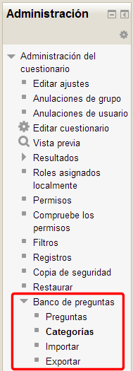
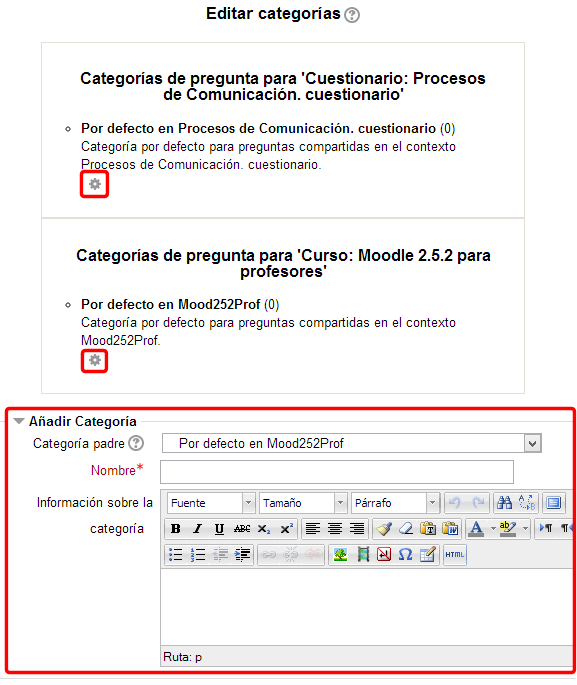
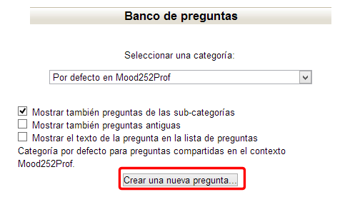

# El banco de preguntas

El Banco de preguntas es un repositorio de preguntas que podremos utilizar en los distintos formularios que creemos para nuestro curso. Se organizan en categorías para facilitar su utilización. Cada categoría tiene un ámbito en el que puede utilizarse, sea en el todo el curso o en uno de los módulos. Para ello tenemos que tener definidos previamente los cuestionarios (aunque estos estén sin preguntas).

Para acceder tenemos que buscar el enlace en el bloque **Administración**:

**Fig. 5.25. Captura de pantalla. Bloque Administración**

 

Si accedemos a Categorías podremos crear nuestras propias categorías y subcategorías rellenando el formulario que aparece para agregar una nueva o pulsando en el icono de edición de cada una de las ya creadas para modificarlas:

**Fig. 5.26 Captura de pantalla. Categorías.**

 

A cada una de estas categorías podremos añadir tantas preguntas como estimemos oportuno. Para ello debemos pulsar en el acceso "**Preguntas**" del **Banco de preguntas** en el bloque **Administración**. Obtendremos lo siguiente:

**Fig. 5.27 Captura de pantalla. Banco de preguntas**

 

Al pinchar en el botón **Crear una nueva pregunta** obtendremos el cuadro de diálogo en el que tenemos que elegir el tipo de pregunta que queremos añadir:

**Fig. 5.28 Captura de pantalla. Crear una nueva pregunta.**

 

Veamos en qué consisten estos tipos de pregunta. No las describimos en el mismo orden en que aparecen en la imagen por agruparlas de alguna manera:

#### De respuesta numérica:

- **Numérica**: Son un tipo de preguntas en la que los alumnos responden con un valor numérico. Se pueden establecer márgenes de error.  
- **Calculada**: Es similar a la pregunta **numérica**, pero en este caso los valores se toman de aleatoriamente de un conjunto de valores introducidos por el profesor. Por ejemplo, si quisiéramos generar muchos problemas de multiplicaciones, podría crearse una ecuación con dos variables { a } * { b }. De esta forma cuando un alumno empiece a resolver los problemas, Moodle adjudicará valores aleatorios para las variables a y b.  
- **Calculada simple**: Este tipo de preguntas es similar al tipo de pregunta **calculada**. Su configuración se realiza en una única pantalla y la diferencia es que no se puede utilizar un conjunto de datos ya creado.  
- **Calculada opción múltiple**: Este tipo de preguntas es similar a la **calculada**. Su configuración es igual y la diferencia es que el profesor propone varias “fórmulas para la respuesta correcta” de manera que cuando al alumno le aparezca la pregunta, le saldrán tantas opciones de respuesta como fórmulas ha incluido el profesor teniendo que marcar aquella que da la solución correcta.  

 

**De respuesta de texto**:

- **Respuesta corta**: Este tipo de preguntas requieren que el alumno conteste con una palabra o frase corta a un enunciado propuesto.  
- **Ensayo**:Este tipo de preguntas le quita al cuestionario la característica autoevaluable porque el alumno responde con un texto a una pregunta propuesta por el profesor, éste la revisa y le da una calificación de forma manual.  
- **Respuestas anidadas (Cloze)**: Esta tipo proporcionan al profesor la posibilidad de enunciar en el mismo texto preguntas de opción múltiple, de respuesta corta o numérica.  

 

#### De emparejamiento:

- **Emparejamiento**: Estas preguntas plantean un enunciado e invitan al alumno a relacionar una serie de elementos “pregunta” con múltiples elementos “respuesta”, de tal forma que ítems y respuestas acaben emparejadas.  
- **Emparejamiento aleatorio**: Se genera una pregunta de este tipo a partir de las preguntas de tipo “Respuesta Corta” de la misma categoría.  

#### De elección:

- **Opción múltiple**: Pregunta tipo test de varias opciones (a, b, c…) con una o varias respuestas correctas.  
- **Verdadero/Falso**: Pregunta en la que los usuarios deciden si es verdadera o no una afirmación que propone el profesor.  

#### Descripción:

- **Descripción**: Este formato no es un tipo de pregunta en sentido estricto. Se limita a mostrar un texto, gráfico, imagen… sin necesidad de responder. Puede ser útil, por ejemplo, para dar información previa antes de un grupo de preguntas.

## Tarea1

Vas a ir preparando una batería de preguntas para tu práctica final. Piensa en las preguntas que pondrías en un cuestionario. Deberías tener al menos una de cada uno de los tipos de los que hemos presentado en videotutorial.
