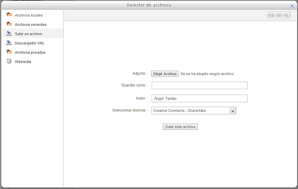
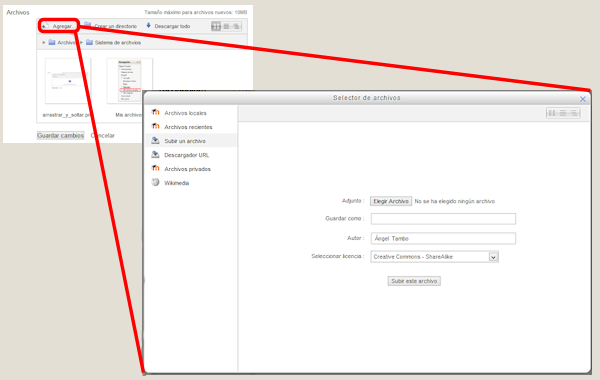
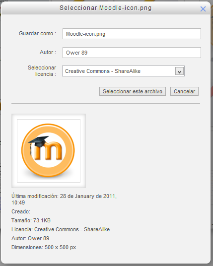

# El Repositorio de archivos

El repositorio de Moodle permite a los usuarios subir archivos desde nuestro equipo o desde otros Repositorios externos o, incluso, explorar las imágenes de una dirección web y mostrarlas para incorporarlas a nuestro repositorio.

**Fig. 3.17 Captura de pantalla. Selector de archivos**

 

En él podemos:

- **Subir un archivo**: como hemos visto en el [capítulo](subir_un_archivo.html) correspondiente.
- **Archivos locales**: Da acceso a los archivos publicados en el curso. El usuario verá aquellos a los que tenga permiso para ver.
- **Archivos recientes**: Muestra los últimos 50 archivos que se han subido.
- **Archivos privados**: Muestra los archivos que se encuentran en la carpeta privada del usuario
- **Descargador URL**: Si se introduce una URL, Moodle busca las imágenes que tiene, dándonos opción a incorporar a nuestros archivos aquella que nos interese.
- **Wikimedia**: Nos pedirá que busquemos un artículo y el tamaño máximo de las imágenes que buscará. Hecho esto, nos presentará todos los archivos que incluye el artículo (imágenes, documentos, vídeos...) para que incorporemos las que nos interesen a nuestros archivos o al módulo en que nos encontremos.

 Para acceder al repositorio tenemos que pulsar el botón Añadir del Sistema de Archivos:

**Fig. 3.18 Captura de pantalla. Acceso al selector de archivos**

 

### ¿Para qué nos sirve?

El Repositorio nos sirve para incorporar archivos al recurso que estemos modificando o a nuestros Archivos privados. Así podemos incorporarlos desde otro recurso (siempre que nuestro permiso nos lo permita), desde nuestro equipo subiendo el archivo o desde un recurso remoto como puede ser la Wikimedia u otra página web cualquiera.

Sería posible, siempre y cuando los administradores de Moodle lo instalaran y habilitaran, incorporar el acceso a otro repositorios como Flikr, Google Docs, Box,...

Al incorporar un archivo desde otro repositorio (pongamos Wikimedia), nos pregunta algunos datos del recurso:

**Fig. 3.19 Captura de pantalla. Incorporación desde otro repositorio**

 

Los datos que nos pide son el nombre que queremos dar al archivo que incorporamos a nuestra carpeta o al recurso que editamos, el autor y el tipo de licencia.

## Tarea1

Busca en Wikimedia algún archivo que interese para el curso que estás haciendo en estas prácticas. Este archivo que puede resultar interesante para incorporar a alguno de los recursos cuando los empieces a crear.
