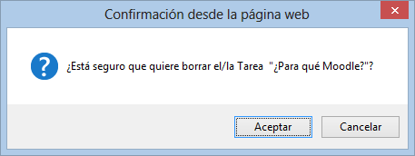

# Eliminar una tarea

Para eliminar una tarea, con la edición activada, pinchamos en el icono elimniar, que aparece al lado del nombre de la tarea.

El sistema nos solicita confirmación y seleccionamos Sí:

**Fig. 5.23 Captura de pantalla. Alerta de eliminación de tarea.**

 

Una vez hecho esto la tarea desaparece del curso.

 

 

## Tarea1

Crea una nueva tarea y vete modificando los distintos parámetros que hemos explicado en el capítulo anterior. Observa cómo se comporta la tarea. A continuación elimínala del curso.
