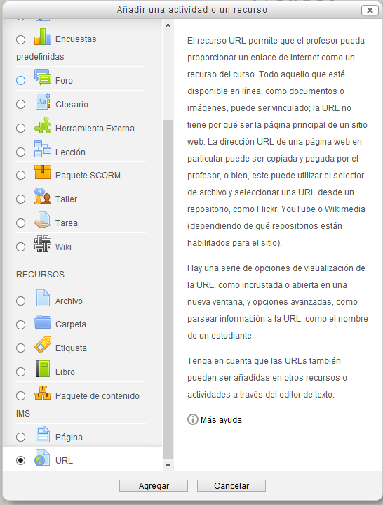

# Enlazar a una URL

Una URL es una dirección que apunta a un archivo. Quizás lo más común sea una dirección que apunta a una página web, pero puede ser también la dirección de una imagen que está en internet, un vídeo de Youtube, o cualquier otro archivo, incluso que esté en nuestro Moodle.

 Eligiendo URL obtenemos esta ventana:

Copiamos la URL en el campo URL externa y le ponemos un nombre y una descripción (optativa) que se mostrarán el la portada del curso de moodle.

Desplegando el menú de apariencia podemos elegir el tamaño de la ventana que se abre al abrir la URL o que se abrá en un a ventana emergente.

https://youtu.be/krpl2GlInDwM 

## Actividad

Utilizando la opción de insertar un recurso URL, busca un vídeo en Youtube que venga al caso para el curso que estás elaborando. Búscalo e insértalo en uno de tus temas.
