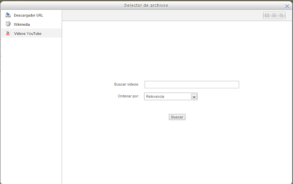

# Enlazar a una URL

Una URL es una dirección que apunta a un archivo. Quizás lo más común sea una dirección que apunta a una página web, pero puede ser también la dirección de una imagen que está en internet, un vídeo de Youtube, o cualquier otro archivo, incluso que esté en nuestro Moodle.

**Fig 3.57 Captura de pantalla de inserción de URL**

 

 Eligiendo URL obtenemos esta ventana:

**Fig 3.58 Captura de pantalla de opciones de URL**

 

Tenemos dos opciones para insertar una URL. Si es a una página web externa debemos ponerla en el cambo **URL** externa. Si es a otro tipo de recurso y también sabemos la URL, podemos también ponerla ahí (Es buena idea copiarla del navegador web y pegarla aquí).

Pero si es una imagen o un vídeo de Youtube, podemos pinchar en el botón **Seleccione un enlace...**

Aparecerá está ventana, muy similar al Repositorio de archivos:

 

No entramos en explicar el funcionamiento porque es igual que el que hemos explicado para el repositorio. La novedad es que podemos buscar vídeos en Youtube. Basta con que pongamos los términos de la búsqueda y Moodle nos ofrecerá el resultado de la búsqueda. Bastará con seleccionar el vídeo.

## Actividad

Utilizando la opción de insertar un recurso URL, busca un vídeo en Youtube que venga al caso para el curso que estás elaborando. Búscalo e insértalo en uno de tus temas.
