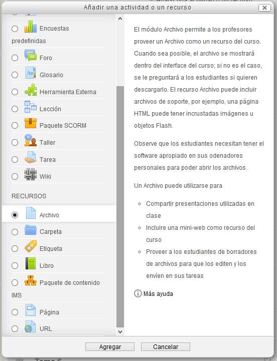
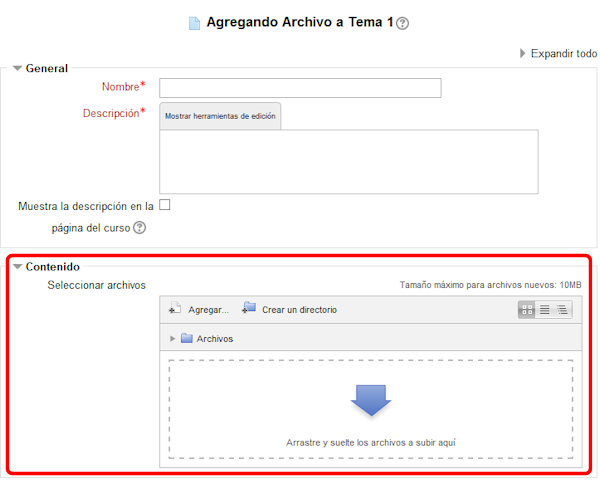
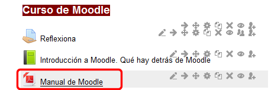
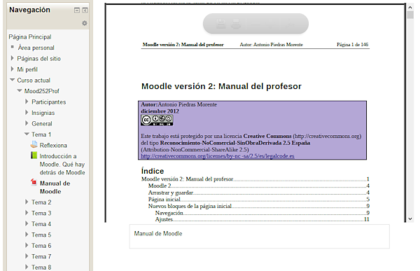

# Enlazar archivo

En la plataforma Moodle podemos enlazar cualquier tipo de archivo que podamos incluir en una web.

Primero debemos **Activar la edición**, y, como siempre, pulsar en el enlace "Añadir una actividad o un recurso" del tema que queramos editar. Aparecerá la ventana de elección de actividad o recurso. Elegimos "**Archivo**". 

 

**Fig. 3.60. Captura de pantalla de inserción de archivo.**

 

Como también vemos la descripción completa del recurso, no incidimos más en ello.

Entraremos en la definición del recurso. Lo de siempre: título y descripción y debajo está lo diferente:

**Fig. 3.61 Captura de pantalla de las opciones para agregar archivo.**

 

Para añadir el archivo no tendremos más que arrastrar y soltar como se ha explicado en el capítulo [Subir un archivo](subir_un_archivo.html) con la posibilidad de utilizar el [repositorio](el_repositorio_de_archivos.html).

Si elegimos **Forzar** y **Guardar cambios y regresar al curso**, veremos incorporado nuestro archivo al tema.

Cuando confirmemos los cambios, el recurso añadido aparecerá así en el tema:

**Fig. 3.62 Captura de pantalla que muestra el archivo insertado en la página del curso**

 

Pinchando sobre él, veremos el archivo, si es posible "incrustado" (embebido dicen los informáticos) en Moodle. En nuestro caso se vería así:

**Fig. 3.63. Captura de pantalla de visualización de un archivo.**

 

Si no pudiera embeberse, el usuario lo descargaría para tener acceso a él fuera de Moodle.

 

## Actividad 5

 

Sube a la página principal de Moodle un archivo, del tipo que quieras, utilizando la página de edición que hemos visto.

Busca también una página web relacionada con el archivo anterior y haz el enlace para que aparezca en la página principal, debajo el archivo.

