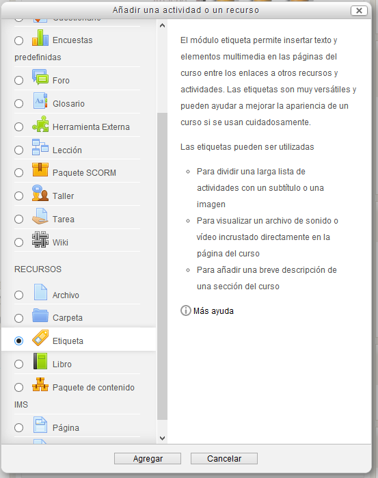

# Etiquetas

Las etiquetas son un recurso que se genera de modo interno y se utilizan para titular, separar o clasificar los contenidos que quieras subir a la plataforma.

Se incluyen como cualquier otro recurso, pulsando en "Añadir una actividad o un recurso" y previamente hay que activar la edición, tal como se ha explicado anteriormente.

**Fig.  Captura de pantalla. Ventana de inserción de etiqueta**

La descripción del recurso nos aparece en la imagen, así que nos evitamos describirlo aquí.

Como las creamos con el editor HTML, disponemos de todas las posibilidades que éste nos ofrece. 
 
Se puede añadir texto e incluso imágenes u objetos multimedia.

La función de las etiquetas es cambiar la apariencia de la portada del curso, dirigiendo la atención y ofreciendo información visual que guíe hacia los contenidos y las actividades.

**Fig.  Captura de pantalla. Ejemplo de etiqueta**

