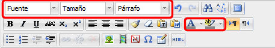
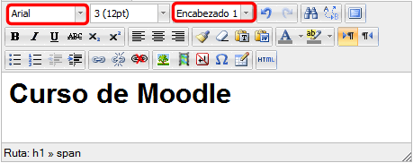
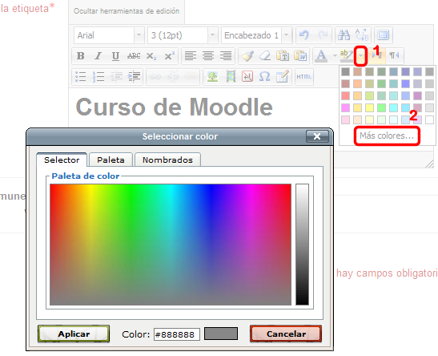
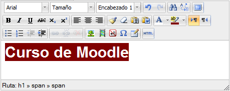
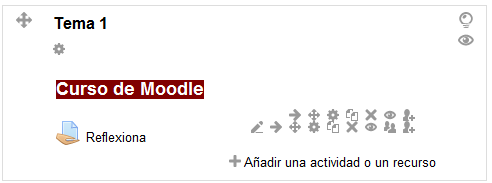

# Etiquetas

Las etiquetas son un recurso que se genera de modo interno y se utilizan para titular, separar o clasificar los contenidos que quieras subir a la plataforma.

Se incluyen como cualquier otro recurso, pulsando en "Añadir una actividad o un recurso" y previamente hay que activar la edición, tal como se ha explicado en el capítulo "[los proveedores](u2_los_proveedores.html)".

**Fig. 3.27 Captura de pantalla. Ventana de inserción de etiqueta**

 

La descripción del recurso nos aparece en la imagen, así que nos evitamos describirlo aquí.

Como las creamos con el editor HTML, disponemos de todas las posibilidades que éste nos ofrece. Vamos a seleccionar y a explicar aquí:

- Fuentes.
- Tamaño de fuentes.
- Formato.
- Color del texto.
- Color de fondo.

En el editor corresponden a los siguientes iconos:

 

**Fig 3.28. Captura de pantalla. Barra de botones del editor HTML**

 

Podemos seleccionar la **fuente**, el **tamaño **y el **formato** que queramos para nuestra etiqueta**. **También puedes determinar el formato del texto con los **encabezados** h1, h2, h3, etc. Siempre es preferible utilizar los encabezados, porque generan menos código y dan lugar a menos errores.

Ten en cuenta que el tipo de letra habría que cambiarlo sólo si es estrictamente necesario porque podríamos elegir un tipo de letra que no tuviera instalado el usuario.

 

**Fig. 3.29 Captura de pantalla. Editor HTML**

 

Para terminar, elegimos el **color** del texto, del fondo, si así lo deseamos:

 

**Fig. 3.30 Captura de pantalla del selector de colores**

Para hacerlo es más sencillo escribir primero el texto y luego seleccionarlo para aplicarle el color de texto y de fondo.

Para hacerlo pulsamos en la flecha que aparece al lado del botón (1 en la figura superior). Aparece una paleta con algunos colores. Si ninguno nos sirve, podemos pulsar en "Más colores..." (2 en la figura), con lo que nos presenta en una nueva ventana la paleta completa, con tres posibilidades de elección de color: Selector, Paleta y Nombrados. Puedes elegir el que quieras y, si supieras el código del color, puedes ponerlo tecleándolo en el cuadro de texto inferior "Color:" (don de en la figura aparece #888888).

Obtendríamos un resultado del tipo de la figura inferior, en la que hemos aplicado un color blanco para el texto y granate para el fondo:

**Fig. 3.31 Captura de pantalla del resultado obtenido sobre el editor de textos**

 

Una vez tengamos el texto de nuestra etiqueta, debemos **Guardar cambios y regresar al curso**:

Podemos ver el resultado, si volvemos a la página principal:

**Fig 3.32 Captura de pantalla del resultado final**

 

## Actividad 2

 

Crea una etiqueta utilizando las posibilidades que hemos visto en este apartado: texto a color, fuente/encabezado, color de fondo, etc.

Ten en cuenta que todo esto te puede servir para el trabajo final.
