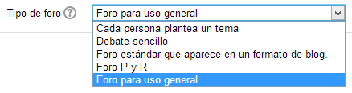

# Foros

El **foro** es el medio para publicar mensajes breves y mantener discusiones públicas sobre el desarrollo y los contenidos del curso o sobre temáticas diversas.

Para crear un foro es necesario pulsar, como siempre, "Agregue una actividad o recurso"

La descripción que aporta moodle de lo que es un foro no cabe en la captura de pantalla, es la siguiente:

El módulo de actividad foro permite a los participantes tener discusiones asincrónicas, es decir discusiones que tienen lugar durante un período prolongado de tiempo.

Hay varios tipos de foro para elegir, como el **foro estándar** donde cualquier persona puede iniciar una nueva discusión en cualquier momento, **un foro en el que cada alumno puede iniciar una única discusión**, o un **foro de pregunta y respuesta** en el que los estudiantes primero deben participar antes de poder ver los mensajes de otros estudiantes. El profesor puede permitir que se adjunten archivos a las aportaciones al foro. Las imágenes adjuntas se muestran en el mensaje en el foro.

Los participantes pueden suscribirse a un foro para recibir notificaciones cuando hay nuevos mensajes en el foro. El profesor puede establecer el modo de suscripción, opcional, forzado o auto, o prohibir completamente la suscripción. Si es necesario, los estudiantes pueden ser bloqueados a la hora de publicar más de un número determinado de mensajes en un determinado período de tiempo; esta medida puede evitar que determinadas personas dominen las discusiones.

**Los mensajes en el foro puede ser evaluado por profesores o estudiantes (evaluación por pares)**. Las clasificaciones pueden agregarse a una calificación final que se registra en el libro de calificaciones.

Los foros tiene muchos usos, como por ejemplo

- Un espacio social para que los estudiantes se conozcan
- Para los avisos del curso (usando un foro de noticias con suscripción forzada)
- Para discutir el contenido del curso o de materiales de lectura
- Para continuar en línea una cuestión planteada previamente en una sesión presencial
- Para discusiones solo entre profesores del curso (mediante un foro oculto)
- Un centro de ayuda donde los tutores y los estudiantes pueden dar consejos
- Un área de soporte uno-a-uno para comunicaciones entre alumno y profesor (usando un foro con grupos separados y con un estudiante por grupo)
- Para actividades complementarias, como una "lluvia de ideas" donde los estudiantes puedan reflexionar y proponer ideas

**Entre las ventajas de la utilización de los foros podemos destacar las siguientes:**

- Ejercitan el **pensamiento crítico** **y creativo** del alumnado al obligarles a basar sus opiniones en argumentos sólidos.
- Favorecen** el aprendizaje entre iguales**.
- Permiten superar las **limitaciones de tiempo y espacio**.
- Obligan al alumnado a **ordenar su pensamiento** para poder expresarlo por escrito.
- Educan en el respeto a las **diferencias de opiniones**.
- Ayudan a **entender y valorar las diferencias**.

Debemos definir el tipo de foro que nos conviene utilizar en función de nuestros objetivos educativos:

### Tipos de foros

**Fig. 5.56 Captura de pantalla. Tipos de foro.**

 

- **Debate sencillo: **Es aconsejable utilizar este tipo de foro cuando desees plantear un único tema de discusión. Una vez configurado el foro, los alumno/as que participen sólo visualizarán la opción "responder" y a partir de allí podrán enviar comentarios sobre el tema tratado. Podrán especificar si quieren recibir copias de los nuevos mensajes del foro en su correo electrónico, y adjuntar un archivo cuyo tamaño no exceda el límite establecido por el profesor/a en la etapa de configuración. Una vez elaborado un comentario, los estudiantes dispondrán de 30 minutos para realizar cambios utilizando las opciones de edición.

- **De uso general:** Puedes utilizar este tipo de foros cuando trabajes un tema que puede suscitar distintos debates. Introducirás en este caso una idea general y será el alumnado el que decida y proponga los temas que podemos debatir. Los alumno/as pueden participar de dos formas distintas: comentando alguno de los temas ya propuestos o iniciando uno nuevo.

- **Cada persona plantea un tema:** Su estructura y utilización es similar al foro de uso general. La diferencia reside en que, en este caso, cada alumno puede proponer un único tema. Su participación se reduce, después, a comentar temas ya propuestos.

- **Foro P y R **(de preguntas y respuestas): Los alumno/as deben responder primero a las preguntas propuestas para poder visualizar las respuestas de sus compañeros. Permite la autoevaluación y es muy enriquecedor al permitir que los alumno/as comenten mutuamente sus respuestas y aportaciones. También es posible hacer búsquedas en un foro. Para realizar una búsqueda avanzada, presiona el botón de búsqueda sin escribir nada en el campo de palabras: aparecerá un formulario completo que le facilitará la realización de búsquedas avanzadas.
- **Foro estándar que aparece en un formato de Blog**: Es un foro abierto en el que cualquier usuario puede iniciar un nuevo tema. La particularidad es que los temas se muestran en una página con enlaces "Discute este tema".

### Videotutorial

En este videotutorial se muestra como usar y configurar los foros:
https://youtu.be/yA_59Sonai0 

