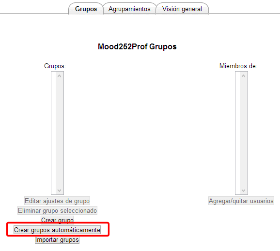
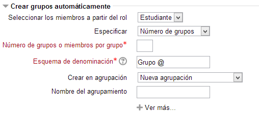
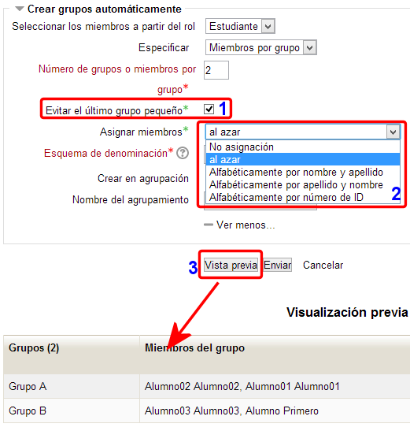

# Grupos automáticos

Otra opción que nos brinda Moodle es generar los grupos de manera automática. Para ello debes pulsar en el panel **crear grupos** el botón c**rear grupos automáticamente.**

**Fig. 4.33 Captura de pantalla. Administración de grupos**

  En el panel que se abre a continuación podremos establecer los criterios de agrupamiento en función de los siguientes parámetros:

**Fig. 4.34 Captura de pantalla. Criterios de agrupamiento**

 

1. **Seleccionar los miembros a partir del rol: **Puedes elegir entre **profesor**, **estudiante** o **todos**. Tendrá en cuenta para los agrupamientos a los usuarios matriculados que tengan el perfil indicado  
1. **Especificar:** Se puede elegir **Número de grupos**, para especificar cuántos grupos queremos, o **Miembros por grupo**, para especificar el tamaño de los grupos.** **
1. **Número de grupos o miembros por grupo:** Aquí se especifica el valor deseado para el parámetro especificado en el punto anterior.  
1. **Esquema de denominación:** Con este esquema aplicará a cada grupo un nombre según es esquema especificado. Así, con el esquema "**Grupo @**" obtendremos los nombres: Grupo A, Grupo B, Grupo C,... y para el esquema "**Grupo #**" obtendremos nombres así: Grupo 1, Grupo 2, Grupo 3,...  
1. **Crear en agrupación**: Puedes elegir que los grupos los genere dentro de una agrupación existente ya en nuestro curso, que se genere una "**Nueva agrupación**" automáticamente, o que se generen sin agrupación.  
1. **Nombre del agrupamiento**: Aquí especificamos el nombre de la agrupación que se ha de generar automáticamente si es que se ha elegido "**Nueva agrupación"** en el punto anterior.

 

Por otra parte, si pulsas el botón **Ver más**, obtenemos dos opciones adicionales:

**Fig. 4.35 Captura de pantalla. Vista previa de grupo**

 

encontrarás nuevas soluciones que te permitirán afinar aún más los filtros para crear automáticamente tus grupos. Podremos elegir, si has elegido, en Especificar, Miembros por grupo, si se crea o no el **último grupo si es más pequeño (1)**. Además podremos optar por **asignar los miembros (2)** al azar, por orden alfabético (en las tres modalidades que vemos en la imagen anterior).

Por último, puedes pulsar el botón **vista previa** **para ver el resultado (3)** antes de dar al botón **enviar**, por si necesitas cambiar algo antes de generar los grupos.

En el siguiente vídeo tutorial puedes ver de un modo rápido como crear grupos automáticamente.

 

**[ ](crear_grupo_auto.swf)**

En el Video tutorial se ha incluido la creación de agrupamientos de forma manual.

## Actividad 6

Crea ahora **tres grupos de manera automática**. Selecciona el** rol de estudiantes**, **número de grupos (3)**, **evitar grupos pequeños** y **ordenar alfabéticamente por apellidos y nombre**. Después, manualmente, **añade un profesor a cada grupo** y **adjudícale una imagen**. No importa si los estudiantes son los mismos que en la actividad anterior.
