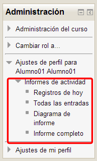
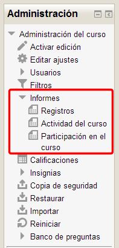

# Informe de actividad

Podemos ver de forma detallada la actividad en el curso de cada uno de los usuarios matriculados, profesores y alumnos. 

No tenemos más que elegir, en el tablón de participantes, al alumno sobre el que queremos el informe. En ese momento, en el bloque Administración tendremos los enlaces para ver los distintos informes que nos da del usuario elegido:

**Fig. 4.52 Captura de pantalla. Bloque Administración. Ajustes de perfil**

 

Además, podemos tener acceso a una información más general del curso si elegimos la opción Informes que tendremos en el bloque de **Administración** en el apartado **Administración del curso**:

**Fig. 4.53 Captura de pantalla. Bloque Administración**

 

En estos informes nos va a permitir filtrar la actividad por fechas, módulos... para tener una idea más exacta de qué está pasando en nuestro curso.

Para conocer esto, puedes ver el videotutorial siguiente:

 

 
