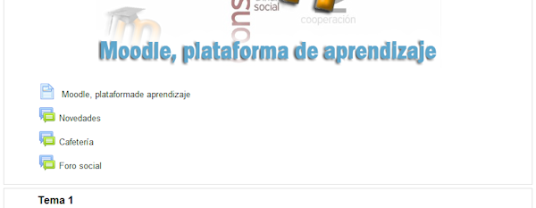
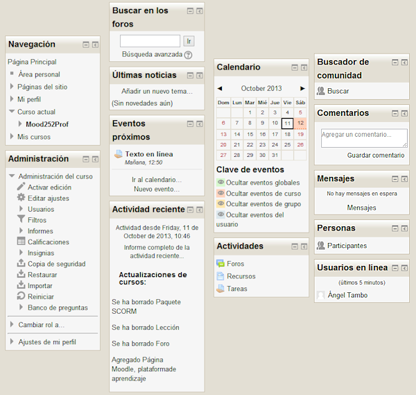
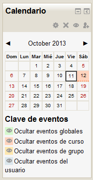

# Las columnas

## ¿Cuántas columnas se aprecian en el siguiente curso? 

### Pregunta

 

#### Respuestas

<label class="sr-av" for="i6_5">[Opción 1](#answer-6_5)</label><input id="i6_5" name="option6_2" onclick="$exe.getFeedback(0,3,'6_2','multi')" type="radio"/>

Dos

<label class="sr-av" for="i6_51">[Opción 2](#answer-6_51)</label><input id="i6_51" name="option6_2" onclick="$exe.getFeedback(1,3,'6_2','multi')" type="radio"/>

Tres

<label class="sr-av" for="i6_54">[Opción 3](#answer-6_54)</label><input id="i6_54" name="option6_2" onclick="$exe.getFeedback(2,3,'6_2','multi')" type="radio"/>

Muchas

#### Retroalimentación

Incorrecto

Opción correcta

Incorrecto

#### Solución

1. [Incorrecto](#answer-6_5) ([Retroalimentación](#sa0b6_2))
1. [Opción correcta](#answer-6_51) ([Retroalimentación](#sa1b6_2))
1. [Incorrecto](#answer-6_54) ([Retroalimentación](#sa2b6_2))

## ¿Y en este otro? 

### Pregunta

#### Respuestas

<label class="sr-av" for="i7_5">[Opción 1](#answer-7_5)</label><input id="i7_5" name="option7_2" onclick="$exe.getFeedback(0,3,'7_2','multi')" type="radio"/>

Cuatro

<label class="sr-av" for="i7_58">[Opción 2](#answer-7_58)</label><input id="i7_58" name="option7_2" onclick="$exe.getFeedback(1,3,'7_2','multi')" type="radio"/>

Ninguna

<label class="sr-av" for="i7_61">[Opción 3](#answer-7_61)</label><input id="i7_61" name="option7_2" onclick="$exe.getFeedback(2,3,'7_2','multi')" type="radio"/>

Dos

#### Retroalimentación

Incorrecto

Incorrecto

Opción correcta

#### Solución

1. [Incorrecto](#answer-7_5) ([Retroalimentación](#sa0b7_2))
1. [Incorrecto](#answer-7_58) ([Retroalimentación](#sa1b7_2))
1. [Opción correcta](#answer-7_61) ([Retroalimentación](#sa2b7_2))

Las columnas de un curso se definen añadiendo o elminando bloques o componentes en el espacio de trabajo, pero siempre tendremos, como mínimo, dos columnas, una zona mas amplia y otra mas estrecha como se aprecia en el segundo ejemplo, y como máximo tres columnas o zonas, como se aprecia en el primer ejemplo.

Tanto si el curso dispone de dos o tres columnas, siempre habrá una **parte central **que presentará los **contenido**s de nuestro curso, **todo el material didáctico y las actividades**, las **pruebas de evaluación**, las **herramientas de comunicación**: foros, chat, etc. En esta zona es donde aparecen los diferentes temas cada uno con las diferentes actividades que se hayan propuesto.

**Fig. 2.6. Captura de pantalla de parte central de contenido en Moodle**

 

En las columnas laterales, tanto si el curso presenta una o dos, existen una serie de bloques que pueden modificarse o cambiarse de posición. En dichas columnas nos podemos encontrar alguno de los elementos o bloques que podemos ver en la imagen siguiente:

** Fig. 2.7. Recopilación de capturas de pantalla de bloques en Moodle**

 

Los bloques y elementos disponibles depende de los que se hayan instalado en la plataforma. Cada bloque tiene un pequeño icono en su parte superior derecha que permite contraer o expandir el contenido del bloque dentro de la columna en la que se encuentra. Al activar la edición del curso, aparece una barra con mas botones que nos permitirán mover el bloque, ocultarlo, cambiarlo de columna o eliminarlo.

 

En la figura siguiente se muestra el aspecto de uno de estos elementos cuando se ha activado la edición, algo que solo podrán hacer los que tengan un perfil con permisos de edición, como veremos más adelante.

 

**Fig. 2.8. Captura de pantalla del bloque Calendario**

