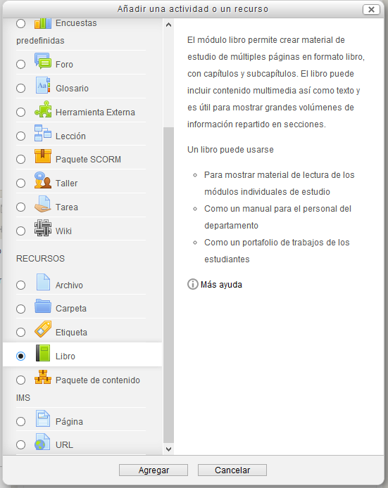
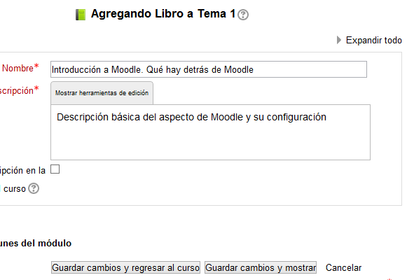
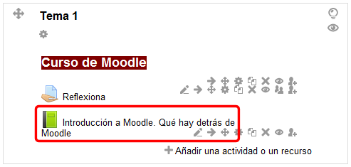
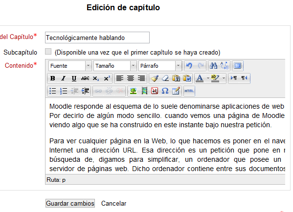
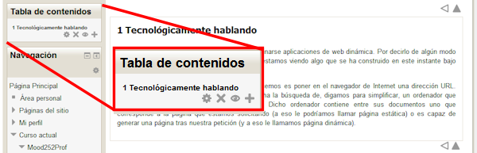
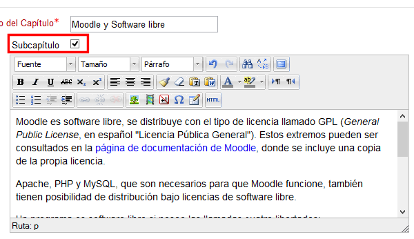
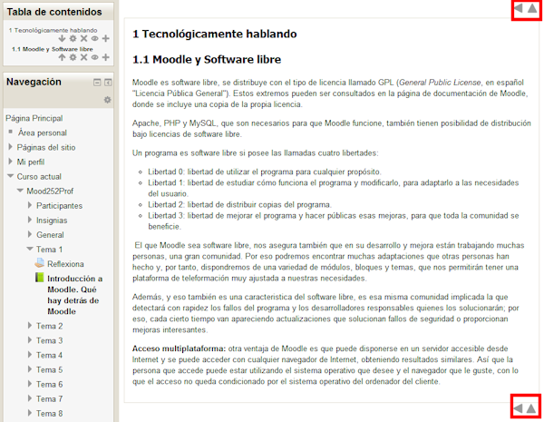

# Libro

Una manera de presentar información al alumno es agregando el recurso **Libro**.

Como siempre, para hacerlo necesitamos activar la edición y pulsar en el enlace "Añadir una actividad o un enlace" del tema en el que estemos trabajando.

**Fig. 3.33 Captura de pantalla. Ventana de inserción del recurso Libro**

 

Como también en la imagen vemos la descripción completa, no hablamos más de ello. Lo que vamos a hacer es ver cómo podemos crearlo y ponerle contenido.

Al elegirlo obtenemos la pantalla en la que tenemos que poner título y descripción al libro. (el resto de opciones vamos a obviarlas por ahora).

**Fig. 3.34 Captura de pantalla de creación de un libro**

 

Una vez puesto el título y la descripción (son obligatorios), podemos pulsar en el botón "**Guardar cambios y regresar al curso**". Con esto ya tenemos creado el libro aunque, de momento, todavía sin contenido:

**Fig. 3.35 Captura de pantalla del resultado de la creación de un libro**

 

Para poner el contenido en el libro sólo tenemos que pulsar en el título para acceder a la página de inserción de contenido:

 

**Fig. 3.36 Captura de pantalla de la edición de un capítulo**

 

Una vez hecho pulsamos en el botón "Guardar cambios". Al hacerlo presenta el contenido del capítulo y, en la columna de la izquierda unas opciones para hacer, si es necesario con este capítulo.

**Fig. 3.37 Captura de pantalla del resultado de la creación de un capítulo**

Las opciones son:

- Editar el capítulo
- Borrar el capítulo
- Ocultarlo
- Añadir un nuevo capítulo

Vamos con esta última opción (el signo +):

**Fig. 3.38 Captura de pantalla de añadir nuevo capítulo**

Date cuenta que hemos marcado la opción Subcapítulo. Haciéndolo creamos un subcapítulo del anterior. Si lo dejamos sin marcar, el nuevo capítulo tendría el mismo rango que el precedente.

Tras pulsar el botón "Guardar cambios" obtenemos los siguiente:

**Fig. 3.39 Captura de pantalla del resultado de la creación de un subcapítulo**

Fíjate en la columna izquierda arriba. Ha creado el subcapítulo y lo muestra "colgando" del primero que hemos hecho. Fíjate también que numera los capítulos y subcapítulos.

En la parte derecha, arriba y abajo, crea flechas de navegación. La primera nos lleva al capítulo anterior. Si hubiera un capítulo siguiente nos mostraría una flecha hacia la derecha para ir al capítulo siguiente. La flecha que apunta hacia arriba nos permite salir del libro.

De esta manera podríamos crear el contenido dividido en capítulos de una forma sencilla y clara. 

 

Visualiza el videotutorial que hay en el siguiente apartado, para ver de forma dinámica la creación de estos recursos. 

## Actividad 3

Redacta un texto con el contenido para uno de los capítulos del curso que estás creando como actividad final de este curso.

Dale estructura de capítulos y subcapítulos. No te preocupes ahora de las actividades. Eso lo veremos más adelante. Ahora se trata de agregar contenido..
