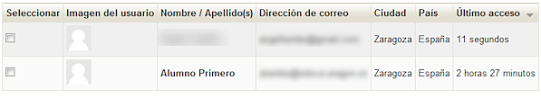
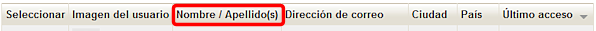
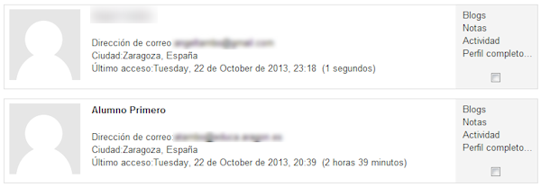
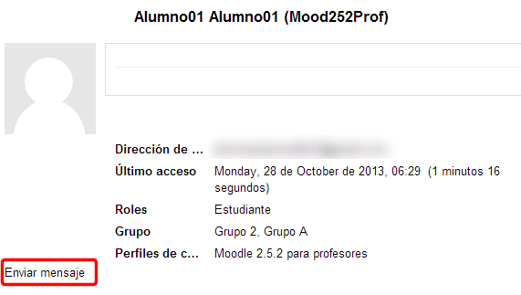

# Listado

En el listado veremos a nuestros participantes según los filtros que hayamos establecido con las opciones mencionadas. Por ejemplo, si seleccionamos la vista **“resumen”** veremos la lista así

**Fig. 4.20 Captura de pantalla Listado de participantes**

 

Por defecto, Moodle ordena la lista por el tiempo pasado desde el último acceso pero podemos cambiar esto haciendo clic en los conceptos que aparecen en la parte superior de la lista:

**Fig. 4.21 Captura de pantalla. Cabecera del listado de usuarios**

 

Así, por ejemplo podemos **ordenar la lista según el nombre y apellidos del usuario**, como en la siguiente imagen. Podemos ordenar la lista según **el nombre y apellidos**, **la ciudad, el país, la dirección de correo o el último acceso**. 

Mientras que si optamos por "**Detalles de usuario**" veremos esto

**Fig. 4.22 Captura de pantalla. Detalles de usuario**

 

En esta vista, en la columna de la derecha tenemos, además de la casilla para seleccionar al participante, desplegadas otras funciones como son: **blogs, notas, actividad o perfil completo**. Veremos para que sirve cada una de estas opciones un poco más adelante, cuando hablemos del **Perfil Personal**. En este caso ya sólo podemos **ordenar la lista por nombre o apellidos**.

Si pinchamos sobre el nombre de uno de los usuarios accederemos a todos sus datos y tendremos la opción de enviarle un mensaje privado:

**Fig. 4.23 Captura de pantalla. Datos de un usuario**

 

Del sistema de mensajería hablaremos más adelante en la [Unidad 6 de este módulo](u6_mensajera.html).

 
