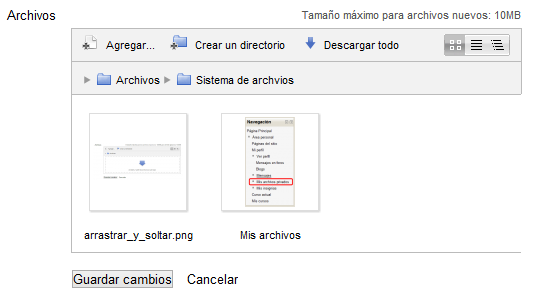
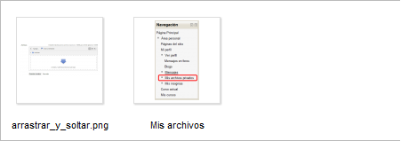
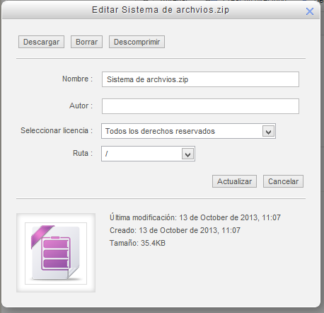

# Opciones para archivos

### Entendiendo el Selector de archivos

Vemos ahora, antes de entrar en las opciones que tenemos para los archivos, cómo es el cuadro del selector de archivos y qué opciones nos ofrece:

Fíjate en la figura siguiente:

**Fig. 3.10 Captura de pantalla Selector de archivos**

 

Vemos que, además de los botones "Guardar cambios" y "Cancelar" tiene tres partes bien separadas:

 

**Fig. 3.11 Captura de pantalla Barra de opciones del Selector de archivos**

** **

Vemos sus elementos de izquierda a derecha:

- **Agregar...**: Ya lo hemos visto antes. Nos sirve para añadir nuevos archivos o carpetas
- **Crear un directorio**: También lo hemos comentado en capítulos anteriores. Nos servirá para crear carpetas nuevas. ¡Atención!, la carpeta la creará dentro de la carpeta en la que nos encontremos en ese momento
- **Descargar todo**: Genera un archivo ZIP con el contenido íntegro de la carpeta en la que nos encontremos, incluidas las subcarpetas y archivos dentro de ellas si es que las tuviera.
<li>**Botones de vista**: Nos permiten ver el contenido de la carpeta en distintos formatos. Son los siguientes:
<ul>
- Vista de iconos: Muestra el contenido como iconos. Es la que tenemos en la figura superior.
- Vista de detalles: Muestra el contenido con los detalles de los archivos y carpetas
- Vista de árbol: Muestra el contenido general con su estructura de carpetas y archivos

 

 **Fig. 3.12 Captura de pantalla. Barra de carpetas del selector de archivos**

La segunda barra nos informa de cuál es la carpeta activa en ese momento. En el caso de la figura nos encontramos en la carpeta "Sistema de archivos" que se encuentra dentro de la carpeta "Archivos" que es la raiz del bloque de carpetas/archivos que estamos visitando

Pinchando sobre cualquiera de ellas nos situaremos en la carpeta elegida. Con esto conseguimos una navegación por las carpetas más rápida.

Esta barra, como ya se ha comentado, desaparece si se elige la vista de árbol en la barra superior, ya que la vista de árbol nos permite la rápida navegación por las carpetas.

 

**Fig. 3.13 Captura de pantalla. Zona de archivos en el Selector de archivos**

La tercera de las áreas del selector es aquella en que nos muestra el contenido de la carpeta en que nos encontremos. Nos mostrará los archivos y carpetas que contenga. En este caso, la carpeta contiene 2 archivos y ninguna carpeta.

 

### ¿Qué podemos hacer con los archivos?

Una vez que hemos subido los archivos podemos hacer algunas cosas con ellos. Basta con pulsar sobre el archivo con el ratón y aparecerá la ventana con las opciones de todo lo que podemos hacer con él:

**Fig. 3.14 Captura de pantalla. Ventana de edición de archivo**

 

Veamos lo que podemos hacer con este archivo:

- **Descargarlo**: Basta con pulsar en el botón "Descargar".
- **Borrarlo**: Pulsando sobre el botón "Borrar"
- **Descomprimirlo**: Esta opción está s**ólo si es un archivo comprimido. **Descomprime en la carpeta en que se encuentra todo el contenido del archivo.
- **Renombrarlo**: Para ello tenemos que teclear el nuevo nombre en el campo de texto "Nombre".
- **Atribuirlo a otro autor**: Por defecto, atribuye el archivo al usuario que lo ha subido, pero podremos cambiarle el nombre del autor. Esto puede ser útil cuando subimos un archivo cuyo autor es otra persona. Si lo compartimos para descarga de terceras personas es lógico atribuirlo a quien es el verdadero autor.
- **Cambiar el tipo de licencia**: Por defecto aparece con "Todos los derechos reservados", pero podemos establecer otro tipo de licencia Creative Commons.
- **Moverlo a otra carpeta**: Para ello tenemos que elegirla en el desplegable "Ruta". El archivo dejará de estar en la carpeta que estaba y pasará a la indicada.

 

## Actividad 3: Opciones para archivos

 

Practica con tus archivos:

- Cambia un archivo de nombre.
- Mueve un archivo a otro directorio.
- Borra un archivo.
- Sitúa dos archivos en un mismo directorio y descárgalos comprimidos.
