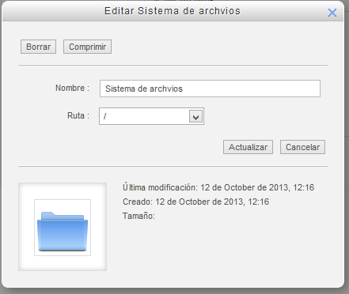
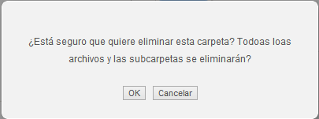

# Opciones para carpetas

Si en lugar de pulsar sobre un archivo pulsamos sobre una carpeta ésta se abrirá y pasaremos a estar situados en ella. Pero si pulsamos **con el botón derecho del ratón **entraremos en la ventana de opciones de la carpeta:

 

**Fig. 3.15 Captura de pantalla. Ventana de edición de carpeta**

 

Veamos qué posibilidades nos ofrece:

 

- **Comprimir la carpeta**: Pulsando sobre el botón "Comprimir" obtendremos un archivo zip con todo el contenido de la carpeta. Este archivo se queda en el servidor. Si quieres, después puedes descargarlo pulsando sobre él.
- **Cambiar el nombre**: Basta con escribir el nuevo nombre en el cuadro de texto "Nombre".
- **Mover la carpeta**: Podemos mover la carpeta a otra localización eligiendo esta nueva localización en el desplegable "Ruta".

## Actividad

Practica un poco con las carpetas. Si lo que tenías subido en tu área personal de archivos, crea una nueva carpeta y sube archivos a ella e, incluso, crea subcarpetas dentro. Luego:

- Cambia el nombre a alguna de las carpetas
- Comprime la carpeta
- El archivo comprimido que se obtiene muévelo a otra carpeta
- Descomprímelo y observa cómo queda
- Bórrala
