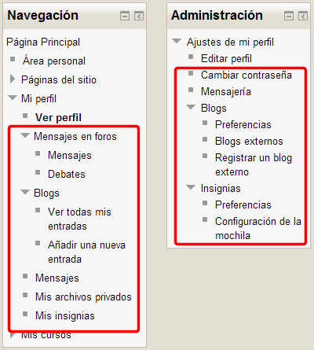
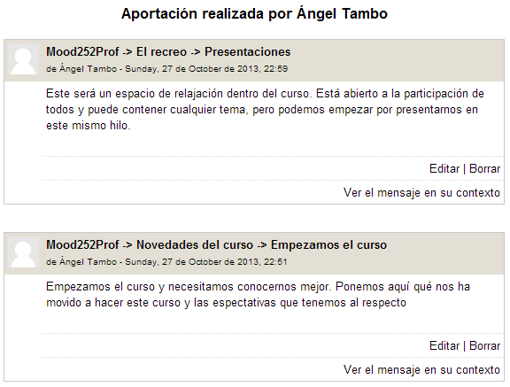
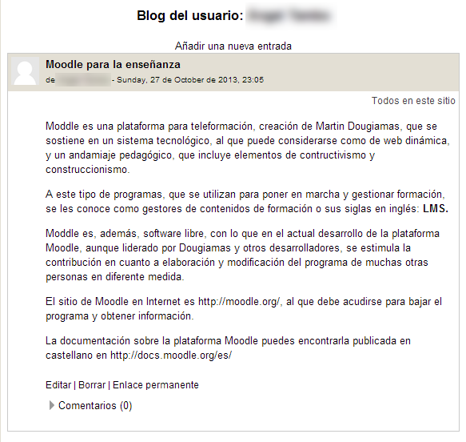
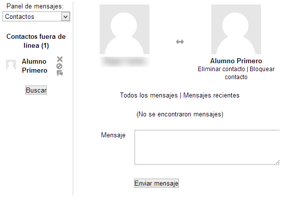
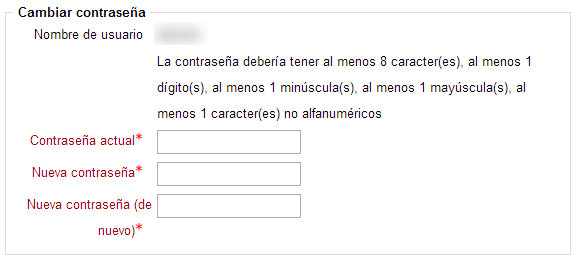

# Otras funciones

Tanto en el bloque de Navegación como en el bloque de Administración podemos encontrar más opciones relacionadas con el perfil personal del usuario. Lo que encontremos en el bloque Administración será relativo a la configuración, que según el permiso que tengamos, podremos modificar. Estas son las opciones:

**Fig. 4.46 Captura de pantalla. Opciones para el perfil**

 

- **En el bloque de Navegación: **  Las opciones que encontramos aquí son: ****Mensajes en foros, Blog, Mensajes, Mis archivos privados ****y** **Mis insignias.****

> 
<ul>

Desde esta pestaña, un usuario puede gestionar los **mensajes y debates **que haya incluido en cualquier **foro del curso**, pudiendo, además, **añadir un tema o editar, contestar o borrar mensajes. **
</li>
<li>

También podemos **añadir un archivo** e incluir **marcas** (tags o etiquetas) de dos tipos: **oficiales** (establecidas por el administrador) o **personales**. En la imagen veréis que, en este caso, no se han establecido marcas oficiales.
</li>
</ul>

## ParaSaberMas

Existe la posibilidad de incluir **bloques de Blog** en los menús laterales de nuestro curso Moodle. Por ejemplo, nos permitiría acceder a **todas las entradas publicadas bajo una etiqueta** en concreto (**Revolución Francesa**). Aunque la explicación de su uso y funciones excede los propósitos de este nivel básico, podéis consultar aquí: [Bloque de Marcas del Blog](http://docs.moodle.org/es/index.php?title=Bloque_de_Marcas_del_Blog&amp;oldid=15291).

> 
<ul>

Nos permite establecer comunicación con los usuarios del curso de manera **asíncrona** (si el destinatario no está conectado en ese momento) o **síncrona** (algo así como un chat ) si ambos usuarios están conectados al mismo tiempo.
</li>
- **Mis archivos privados: ** Es el apartado que nos permite gestionar nuestros propios archivos en el curso. Ya lo hemos comentado en el módulo 3 cuando habláblamos del sistema de archivos.   
- **Mis insignias**:  Las insignias son la manera de celebrar los logros que obtienen nuestros alumnos en el curso. Las insignias se crean y administran desde el bloque **Administración &gt; Insignias**. Se otorgan a los alumnos según los criterios que quiera establecer el profesor. Estas insignias pueden otorgarse al completar alguna actividad o al completar el curso. Estas insignias se mostrarán siempre que se muestre el perfil del usuario al que le han sido concedidas.
</ul>

 

- **En el bloque Administración  **

> 
<ul>

</ul>
 
<ul>
- **Mensajería  ** Permite modificar cómo y qué mensajes de notificación se van a recibir y por qué método: por email o por el sistema de mensajería en una ventana emergente de Moodle.  
</ul>

## Pregunta Verdadero-Falso

### Pregunta 1

#### Sugerencia

<label for="true0b153"><input id="true0b153" name="option0b153" onclick="$exe.getFeedback(0,2,'0b153','truefalse')" type="radio"/> Verdadero</label>
<label for="false0b153"><input id="false0b153" name="option0b153" onclick="$exe.getFeedback(1,2,'0b153','truefalse')" type="radio"/> Falso</label>

#### Retroalimentación

**Falso**

### Pregunta 2

#### Sugerencia

<label for="true1b153"><input id="true1b153" name="option1b153" onclick="$exe.getFeedback(0,2,'1b153','truefalse')" type="radio"/> Verdadero</label>
<label for="false1b153"><input id="false1b153" name="option1b153" onclick="$exe.getFeedback(1,2,'1b153','truefalse')" type="radio"/> Falso</label>

#### Retroalimentación

**Verdadero**

### Pregunta 3

#### Sugerencia

<label for="true2b153"><input id="true2b153" name="option2b153" onclick="$exe.getFeedback(0,2,'2b153','truefalse')" type="radio"/> Verdadero</label>
<label for="false2b153"><input id="false2b153" name="option2b153" onclick="$exe.getFeedback(1,2,'2b153','truefalse')" type="radio"/> Falso</label>

#### Retroalimentación

**Verdadero**

### Pregunta 4

#### Sugerencia

<label for="true3b153"><input id="true3b153" name="option3b153" onclick="$exe.getFeedback(0,2,'3b153','truefalse')" type="radio"/> Verdadero</label>
<label for="false3b153"><input id="false3b153" name="option3b153" onclick="$exe.getFeedback(1,2,'3b153','truefalse')" type="radio"/> Falso</label>

#### Retroalimentación

**Falso**

### Pregunta 5

#### Sugerencia

<label for="true4b153"><input id="true4b153" name="option4b153" onclick="$exe.getFeedback(0,2,'4b153','truefalse')" type="radio"/> Verdadero</label>
<label for="false4b153"><input id="false4b153" name="option4b153" onclick="$exe.getFeedback(1,2,'4b153','truefalse')" type="radio"/> Falso</label>

#### Retroalimentación

**Verdadero**

## Actividad 10

Entra en tu perfil personal y realiza las siguientes tareas:

1) Desde la pestaña mensajes haz un** nuevo tema para un foro**.

2) Incluye una **entrada nueva en tu blog**, comentando algo sobre el curso que estás haciendo. **Crea una marca o etiqueta **con tu apellido + Moodle.

3) Incluye una **nota personal  para un estudiante** de tu curso. 

