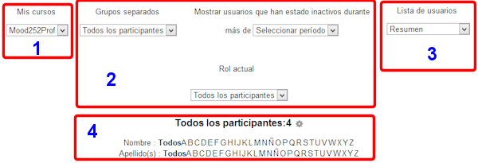
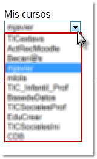

# Panel superior

**Fig. 4.18 Captura de pantalla. Opciones del panel de participantes**

 

Esta parte del panel es la que nos permite filtrar nuestra consulta de las siguientes maneras:

1. **Selector de grupos**: esta opción nos aparecerá **siempre que hayamos configurado** **grupos** en nuestro curso. Cómo hacer grupos lo veremos enseguida, pero de momento debemos saber que esta opción nos permite acceder al listado de los **estudiantes de cada grupo** y su profesor/a asignado.  Si combinamos esta opción con la de **seleccionar el rol** que queremos ver, podemos tener un filtro muy ajustado a nuestras necesidades de cada momento.   
1. En este menú desplegable, podemos seleccionar el **nivel de detalle** con que la lista de participantes nos muestra la información  
1. Por último, podemos**seleccionar** a los participantes según la inicial de su **nombre**, de su **apellido **o **combinar ambas**.

  

## Actividad 3

Con los estudiantes que has matriculado, prueba todas las combinaciones posibles de filtros del panel de participantes hasta familiarizarte con él.
