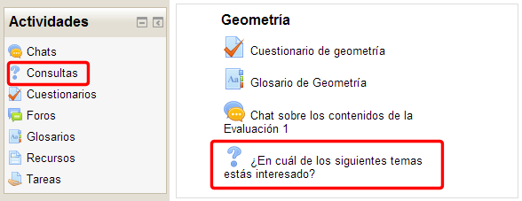
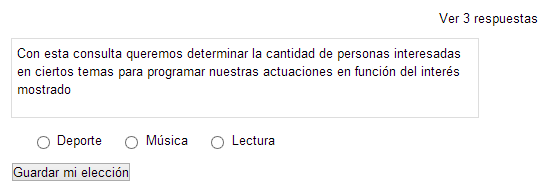
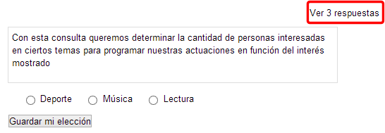
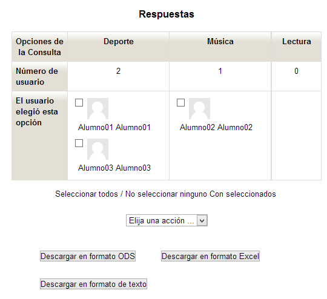

# Participación en la consulta

Para participar en una **consulta**, se busca en el bloque de **Actividades**, **Consultas **o se hace clic directamentes sobre ella en el tema del curso en el que lo hemos añadido:** ¿En cuál de los siguientes temas estás interesado?**

**Fig. 5.85 Captura de pantalla. Acceso a la consulta.**

 

Una vez abierta la consulta se nos presenta de la siguiente manera:

**Fig. 5.86 Captura de pantalla. Vista de consulta.**

 

Se selecciona la opción que se quiera y **Guardamos la elección.**

Cuando los alumnos/as hayan contestado la consulta, el profesor/a podrá ver los resultados de la misma en el formato que haya elegido al configurarla.

Para ello entra en la **consulta **y pincha en **Ver 3 respuestas**

**Fig. 5.87 Captura de pantalla. Ver respuestas.**

 

**Fig. 5.88 Captura de pantalla. Respuestas.**

 

Desde este menú puede:

- **Seleccionar votos y Borrarlas**.
- **Descargar las respuestas** en tres formatos: **ODS, Excel o texto**.
