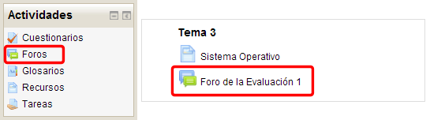
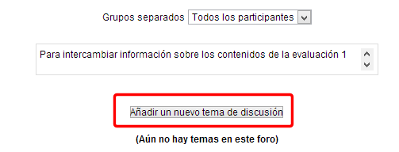
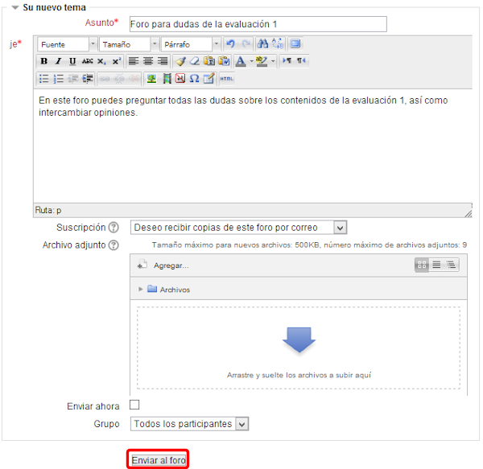
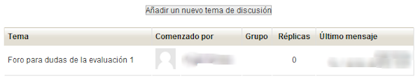
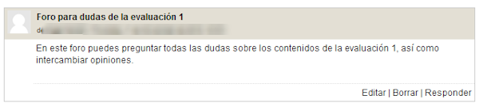

# Participar en un foro

El foro aparecerá en el tema del curso en el que lo hemos añadido: **Foro de la evaluación 1.**

**Fig. 5.65 Captura de pantalla Accesos a los foros.**

 

Haciendo clic en el **Foro de la evaluación 1 **aparece la pantalla siguiente:

**Fig. 5.66 Captura de pantalla. Añadir nuevo tema de discusión.**

 

Vamos a hacer una** primera intervención en el foro**, para ello hacemos clic en **Añadir un nuevo tema de discusión**:

**Fig. 5.67 Captura de pantalla. Opciones para un nuevo tema.**

 

- **Asunto**: Título o tema del foro.
- **Mensaje**: escribimos una breve descripción de la temática o finalidad del foro.
<li>**Suscripción**: Cuando alguien se subscribe a un foro recibe por correo electrónico una copia de cada mensaje enviado a ese foro (los mensajes son enviados aproximadamente 30 minutos después de haber sido escritos). Los participantes normalmente pueden escoger si desean o no suscribirse a cada uno de los foros. Sin embargo, si un profesor/a fuerza la suscripción a un foro concreto, esta posibilidad de elección es anulada y todos recibirán copias por correo electrónico de los mensajes de ese foro. Esto es especialmente útil en el foro de Noticias y en los foros de principio del curso (antes de que todos sepan que pueden suscribirse por sí mismos). Tenemos dos opciones para seleccionar:    
<ul>
- **Deseo recibir copias de este foro por correo**.
- **No deseo recibir copias de este foro por correo**.

- **Enviar ahora**: El mensaje se envía en ese mismo momento por correo electrónico a los usuarios suscritos, sin el retardo habitual de 30 minutos.
- **Archivo adjunto:** Se pueden adjuntar en este caso hasta 9 archivos de cualquier tipo. Estos archivo son subidos al servidor y guardado con su mensaje. En este caso se permite adjuntar archivos hasta un máximo de** 500 kb**.

## IMPORTANTE

Para finalizar hacemos clic en **Enviar al foro.**

Aparece un mensaje con el texto en que nos informa que disponemos de 30 minutos para editarlo. A partir de ese momento no podremos modificarlo y se enviará a todos los suscritos una copia por correo electrónico.** **

El mensaje ha quedado publicado en el foro.

**Fig. 5.68 Captura de pantalla. Mensaje**

 

Para **verlo** se haz clic en el tema del mensaje y el mensaje se mostrará en la pantalla siguiente:

**Fig. 5.69 Captura de pantalla. Mensaje**

 

Desde aquí podemos:

- **Editar**:permite corregir el contenido de la entrada.
- **Borrar**: permite borrar la entrada.
- **Responder**: permite contestar al mensaje.

También podemos volver a la pantalla de configuración haciendo clic en el botón **Actualizar foro. **

Haciendo clic sobre la imagen siguiente puedes ver un videotutorial sobre **cómo configurar un foro y añadir una entrada**:

## Tarea1

Configura la temática del foro y haz una primera intervención como profesor/a. A continuación cambia tu rol a estudiante y responde a dicha intervención.
