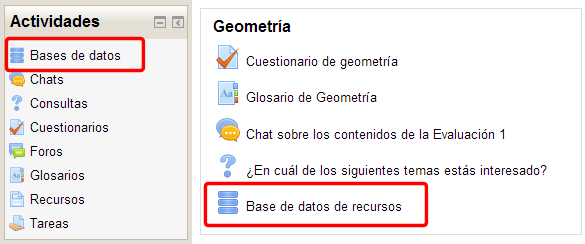
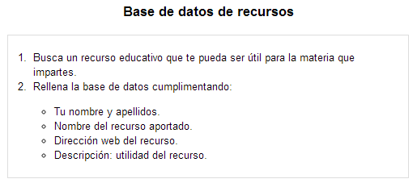
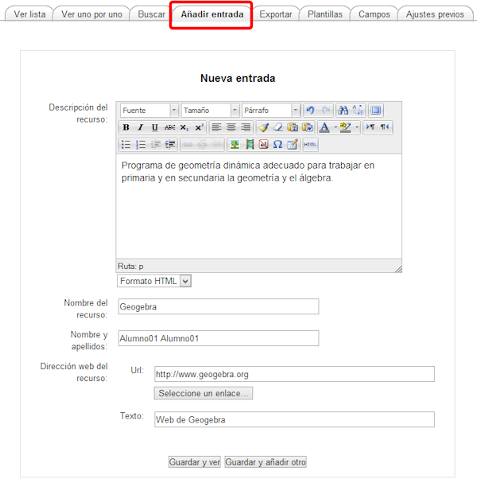
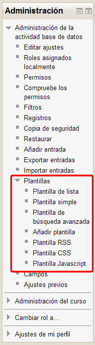
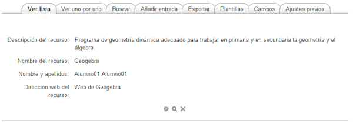

# Participar en una base de datos

Para participar en una **base de datos**, se busca en el bloque de **Actividades**, **base de datos** o se pincha directamente sobre ella en el tema del curso en el que lo hemos añadido: **Base de datos de recurso**s

**Fig. 5.98 Captura de pantalla. Accesos a la bases de datos**

 

Haciendo clic sobre ella aparece la descripción de la base de datos así como los campos que deben rellenar.

**Fig. 5.99 Captura de pantalla. Vista de base de datos.**

 

Para intervenir hay que entrar en el menú **Agregar entrada **y rellenar los campos:

**Fig. 5.100 Captura de pantalla. Añadir entrada.**

 

**Guardamos **y ya podemos ver nuestra entrada. 

Si hemos seguido exactamente el proceso descrito no mostrará ningún dato porque no se ha definido la plantilla en que se verá. Para hacerlo debemos ir al **bloque Administración** (Administración de la actividad) y elegir una entre las que se presentan:

**Fig. 5.101 Captura de pantalla. Bloque Administración. Administración de la base de datos**

 

Las plantillas pueden editarse pulsando en la pestaña Plantillas, pero no vamos a entrar en eso.

Una vez elegida la plantilla, en nuestro caso la plantilla de lista obtendremos el siguiente resultado:

 

**Fig. 5.102 Captura de pantalla. Vista de base de datos.**
