# Páginas web

En este recurso puedes utilizar todas las posibilidades que te ofrece el editor HTML.

Vamos a incidir en las siguientes:

- Insertar vínculo.
- Quitar vínculo.
- Insertar imagen.
- Insertar tabla.
- Visualizar código HTML.

 

En el editor corresponden a los siguientes iconos:

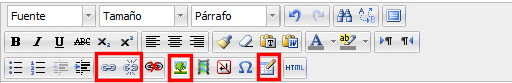

**Fig. 3.40. Captura de bantalla de la barra de botones del editor HTML**

 

Para incluir una Página tenemos que **activar la edición**, como hemos hecho en otras ocasiones, y pulsar en el enlace "**Añadir una actividad o un recurso**" del tema en el que queramos trabajar. En la ventana que aparece elegimos la opción **Página** entre los recursos que nos ofrece:

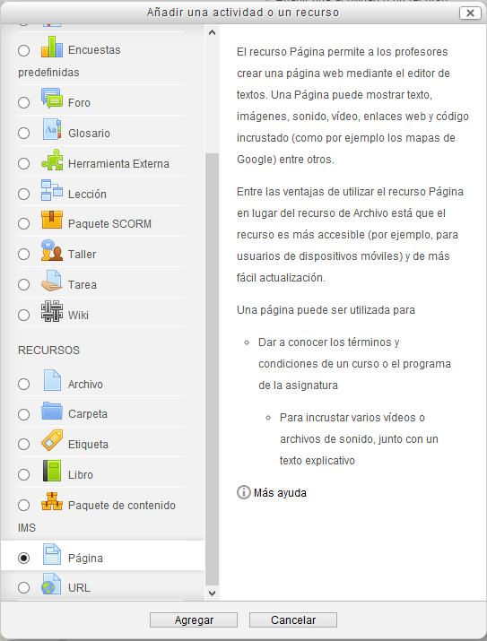

**Fig. 3.41 Captura de pantalla de selección de página**

 

Obtendremos la siguiente ventana en la que rellenaremos los campos título y descripción. Debajo podremos añadir el contenido de la página que queremos crear:

**Fig. 3.42 Captura de pantalla de la opciones de página**

Vamos a poner contenido utilizando las herramientas que hemos mencionado antes.

### Insertar vínculo

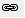

Debemos seleccionar este icono, que representa el eslabón de una cadena, si queremos establecer un **vínculo** dentro del documento.

Puede ser un enlace interno, que hayamos creado con el ancla dentro del propio documento (aunque con esta configuración del editor no puede hacerse sin utilizar código HTML, o bien un enlace externo, ya sea de la Web o de cualquier otro sitio de la plataforma.

Como ya sabes, cada lugar de la plataforma tiene su propia url, así que podemos movernos dentro de ella con facilidad.

En nuestra web podemos incluir un **enlace externo**, para dirigir al alumno a una fuente de información determinada.

Para hacerlo debemos **marcar** el texto, insertar la dirección donde nos indica **URL** y elegir el **destino**. Cuando se trata de un enlace externo, conviene elegir **Nueva ventana**, porque ofrece mejor visibilidad.

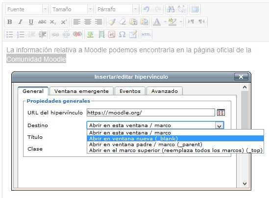

**Fig. 3.43 Captura de pantalla de inserción de vínculo **

 

Una vez que se ha creado el enlace nos aparecería el editor de esta manera:

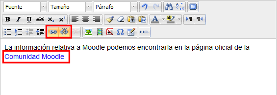

**Fig. 3.44 Captura de pantalla del editor **

 

Observamos que el texto al que hemos aplicado el enlace ha cambiado de color (ahora es un enlace) y que los iconos también han sufrido un pequeño cambio. Ahora el botón de "Quitar hipervínculo" aparece activado. Esto sucede sólo porque tenemos el cursor colocado sobre el vínculo.

Además, el botón de crear enlace aparece activo aunque no tengamos ningún texto seleccionado. Es así porque, al colocar el cursor sobre un enlace podremos editar las características del enlace en que nos encontramos. Tendremos acceso a la ventana de "Insertar/Editar hipervínculo" que nos ha aparecido antes para cambiar las características del enlace.

 

### Quitar vínculo

Para eliminar un vínculo, se marca el texto o la zona vinculada, o símplemente se coloca el cursor sobre él y se hace clic sobre el icono del eslabón roto:

 

### Insertar imagen

El icono del paisaje nos permite insertar una imagen.

Si en la página web de Moodle queremos añadir imágenes, por ejemplo del icono, conviene que busquemos aquellas que tengan licencia **Creative Commons**, es decir, que su autor permite que se copien y se utilicen con cierta libertad (habría que mirar cuáles son las limitaciones que establece en su licencia), si bien para fines educativos la **Ley de Propiedad Intelectual**, en su [artículo 32.2](http://civil.udg.es/normacivil/estatal/reals/Lpi.html), permite a los profesores de la educación reglada utilizar sin permiso del autor fragmentos de su obra. Sí que hay que señalar la fuente de la que se ha tomado y al autor, si se conociera.

En este caso utilizamos una imagen del logo de Moodle**,** que especifica la fuente, el autor y el tipo de licencia o situación legal de la imagen (ver [enlace](http://commons.wikimedia.org/wiki/File:Logomoodle.svg)). Debes guardarla en tu ordenador antes de insertarla.

Sitúa el cursor donde vayas a insertar la imagen y haz clic en el icono correspondiente. Sale el cuadro de diálogo siguiente:

 

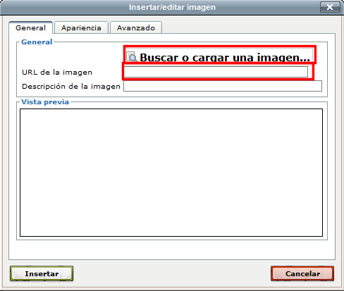

**Fig. 3.45 Captura de pantalla del diálogo para cargar una imagen**

 

Tenemos la posibilidad de utilizar imágenes subidas o que vayamos a subir al nuestro repositorio, o imágenes de las que tengamos la dirección URL. La primera opción nos asegura que vamos a tener la imagen el tiempo que la necesitemos porque la subiremos a nuestro Moodle. Sin embarlo, la segunda opción, la de incluir la URL evita que ocupemos nuestro servidor con ella pero dependemos de que la tenga el propietario en la dirección indicada, lo que no siempre sucede.

Nosotros vamos a optar por poner una imagen del repositorio. Para ello vamos a introducir la dirección URL de la página en la que se encuentra la imagen que nos interesa y procedemos como se ha explicado en el tema anterior en el capítulo El repositorio de archivos.  Para ello pulsamos "**Buscar o cargar una imagen...**", sobe el cuadro de diálogo anterior.

Una vez elegida la imagen de la página, nos presenta este cuadro de diálogo:

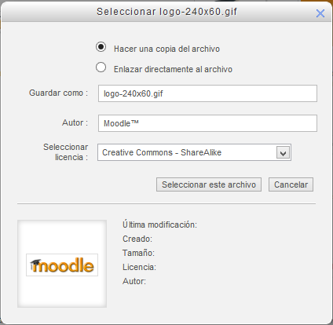

**Fig. 3.46 Captura de pantalla del selector de imagenes**

 

Pulsando en "Seleccionar este archivo" se nos pone en la ventana de inserción de imágenes para que pongamos los datos que nos interesen:

**Fig. 3.47 Captura de pantalla para insertar una descripción**

 

Conviene que, al menos, pongamos la Descripción de la imagen. Al pulsar en **Insertar**, la imagen se coloca en nuestro editor:

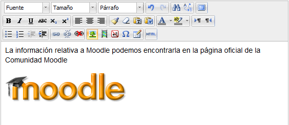

**Fig. 3.48 Captura de pantalla del resultado obtenido insertando una imagen**

 

 

### Insertar tabla

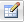

Con este icono, que representa una tabla, podemos incorporar una a nuestra página. Moodle nos ofrece las posibilidades habituales para configurar la tabla: filas, columnas, alineación, etc.

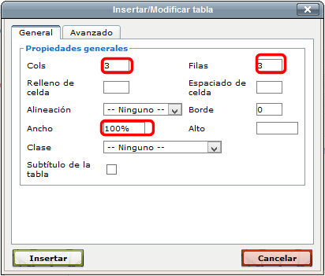

**Fig. 3.49 Captura de pantalla de la configuración de una tabla**

 

Para trabajar mejor con la tabla, podemos acceder a un menú específico, si elegimos la opción de **Agrandar el editor**:

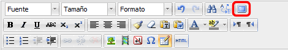

**Fig. 3.50. Captura de pantalla de la barra de botones del editor HTML**

 

Para modificar una tabla ya creada basta con situarse dentro de ella y pulsar el botón de insertar/editar tabla. También podemos pulsar con el botón derecho del ratón sobre la tabla:

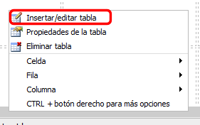

**Fig 3.51 Captura de pantalla del menú contextual de una tabla**

 

Aquí también tenemos opciones para borrar la tabla completa (y su contenido) y para modificar la configuración de cada celda o de las celdas que haya seleccionadas, o de las filas o columnas:

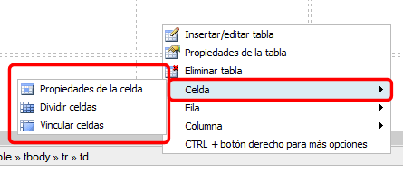

**Fig 3.52 Captura de pantalla de opciones para configurar una celda**

 

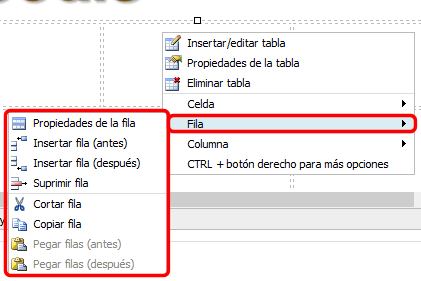

**Fig 3.53 Captura de pantalla de opciones para configurar una fila**

 

**Fig 3.54 Captura de pantalla de opciones para configurar una columna**

 

### Visualizar código HTML

Con este icono podemos visualizar cualquier documento Moodle que disponga de esta utilidad.

Nuestra página  tendría este aspecto en HTML:

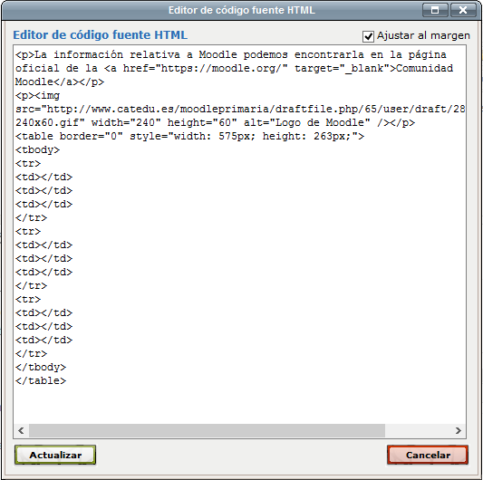

**Fig 3.55 Captura de pantalla de la vista de código HTML**

 

Sólo si dominas, al menos mínimamente, el código HTML deberías modificar desde aquí tu página. si no sabes nada de HTML es mejor que no lo toques.

Haciendo clic en "**Actualizar**", volveríamos a la visión normal del documento haciéndose efectivos los cambios realizados, o "**Cancelar**" para desechar los cambios.

Una vez terminada la página, la guardamos eligiendo entre: **Guardar cambios y mostrar** o **Guardar cambios y regresar al curso**. 

Puedes ver de forma más gráfica la creación de este recurso en el videotutorial que aparece en el siguiente apartado.

## Actividad 4

 

Crea una página web que contenga:

- Un enlace externo.
- Una imagen.
- Una tabla de, al menos, 3 columnas y 3 filas.

Insistimos en lo de siempre. Procura que lo que hagas sea "real", es decir, que te sirva para tu proyecto final. Así tendrás camino ya andado.
