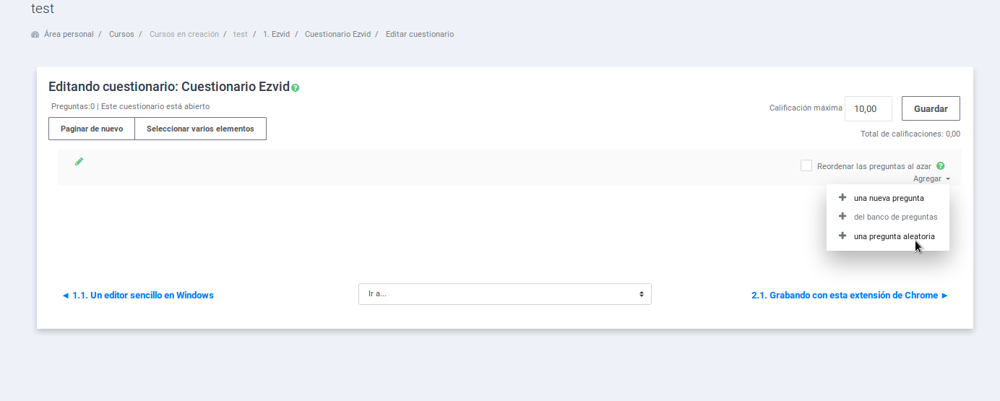
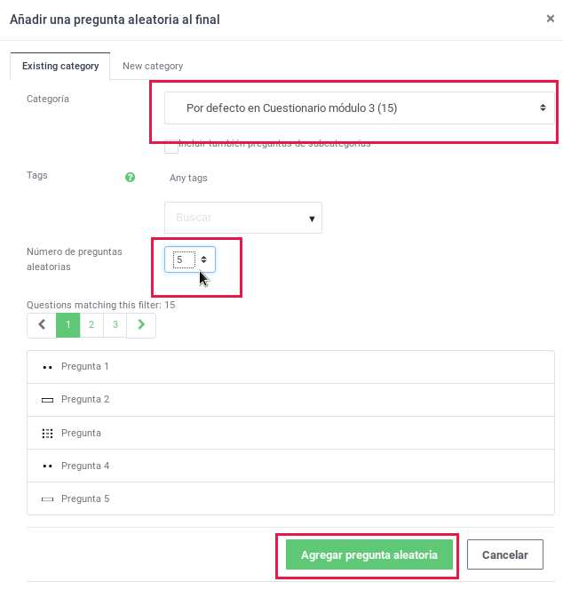

### Generar cuestionario con preguntas al azar

Para generar cuestionarios con preguntas al azar, primero tendremos que [crear una categoría en el banco de preguntas y añadir las preguntas en cuestión](el_banco_de_preguntas.md). Una vez hecho ésto, ya podemos añadir preguntas aleatorias como se muestra en las siguientes imágenes.

En la edición del cuestionario, cuando aún está vacío, clicamos en "Agregar" > "una pregunta aleatoria":

Luego seleccionamos la categoría de la que queremos obtener las preguntas y establecemos el número de preguntas aleatorias que se mostrarán en cada intento:

