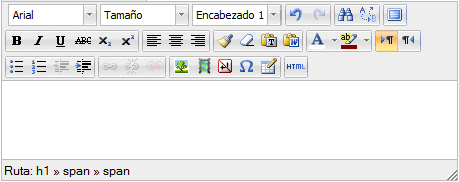

# Recursos internos

| **Fig. 3.24. Editor HTML**

Los **recursos internos** se pueden elaborar desde dentro de la plataforma, aunque podamos incorporar también elementos externos.

Incluimos en este grupo:

- Las etiquetas.
- Las páginas de texto.
- Las páginas web.

Moodle dispone de un **editor HTML** enriquecido, que permite dar formato al texto y generar código HTML. Podemos utilizarlo al editar o actualizar cualquier actividad.

Vamos a ver a continuación sus utilidades.

 
