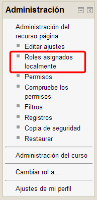
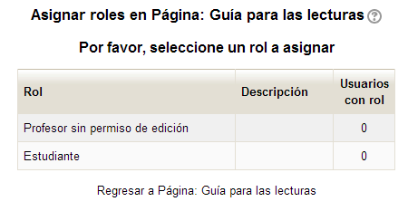
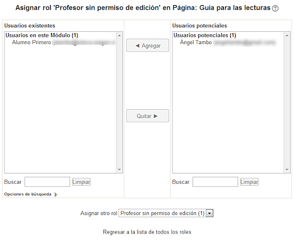

# Roles por módulos

Además de asignar roles de manera global en un curso, Moodle nos permite también configurar roles por cada uno de los recursos o actividades.

Para ello tendríamos que entrar en la propia actividad o recurso y en el bloque Administración que nos queda, elegir **Roles asignados localmente**:

**Fig. 4.13 Captura de pantalla. Bloque administración - Administración de un recurso**

 

Nos aparecerá la ventana con la lista de roles disponibles y cuántos hay asignados en este momento:

F**ig. 4.14 Captura de pantalla. Roles disponibles.**

 

Pinchando en cada uno de ellos podremos asignar, sólo para esta tarea, un rol distinto a los usuarios matriculados en nuestro curso:

**Fig. 4.15 Captura de pantalla. Asignación de roles**

 

Esto podría ser interesante si, por ejemplo, tuviéramos en un curso dos grupos de estudiantes y quisiéramos que uno de ellos realizara una actividad y otro no. Para ello deberíamos solicitar a nuestro administrador que creara un rol específico para cada grupo de estudiantes, de manera que en la actividad correspondiente pudiéramos adjudicar el acceso sólo a uno de los dos.

Esta función nos permitiría establecer niveles diferentes dentro del mismo curso. También podría servir para que los profesores-no editores accedieran a módulos diferentes según las necesidades de sus grupos.
