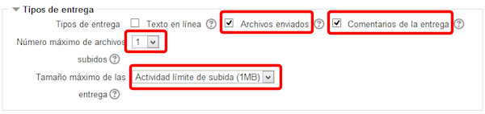
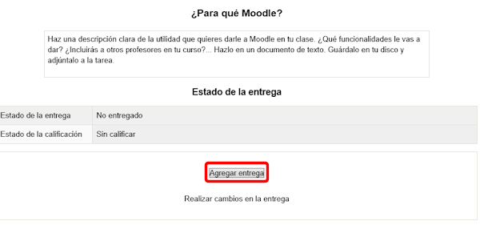
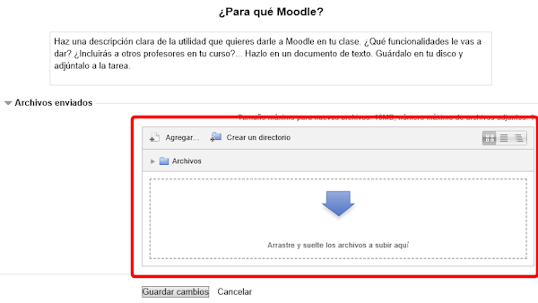
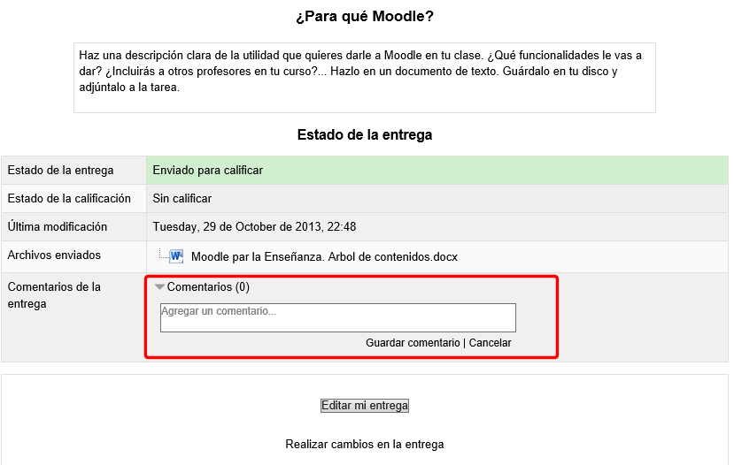

# Subir archivos

El proceso para crear una tarea de este tipo es idéntico a los dos anteriores. La única excepción está en la elección del **Tipo de entrega**: 

**Fig. 5.10 Captura de pantalla. Tipo de entrega**

 

Ahora tendremos que marcar la opción **Archivos enviados**, y tendremos que decidir si marcamos la casilla de **Comentarios de la entrega**, que permitirá a los alumnos poner comentarios asociados a los archivos que entrega.

También tendremos que elegir el **número máximo de archivos** que podrán subir los alumnos para esta tarea y el** límite de subida**, que por defecto está marcada en 1Mb.

El alumno verá así la tarea:

**Fig. 5.11 Captura de pantalla. Vista de tarea**

 

Como hemos visto para las tareas de texto en línea, tiene el botón Agregar entrega, que ha de pulsar para proceder a la subida del archivo. Obtendrá esta pantalla:

**Fig. 5.12 Captura de pantalla. Vista de la entrega de tarea**

 

Vemos el ya conocido selector de archivos. Podrán subir tantos archivos como se hayan marcado en la definición de la tarea y, aunque diga otra cosa, del tamaño máximo elegido.

Si subimos un archivo de mayor tamaño del permitido, aparentemente lo subirá, pero no lo admitirá al pulsar en Guardar cambios.

Una vez que hemos subido el archivo que se nos pide y ya que hemos definido la tarea como que permitirá comentarios a los archivos subidos, obtendremos esta pantalla al pulsar **Guardar cambios**:

**Fig. 5.13 Captura de pantalla. Vista de tarea para insertar comentario**

 

Aquí el alumno podrá escribir los comentarios que estime oportunos.

## Importante

Podemos combinar las tareas y pedir uno o varios archivos y, a la vez texto en línea. En tal caso presentará el editor HTML y el selector de archivos.

## Tarea1

Agrega a tu curso una tarea en la que el alumno/a deba subir un archivo.
