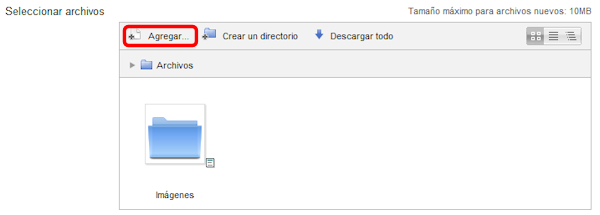
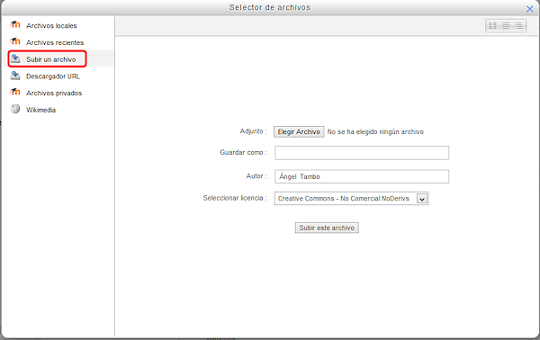
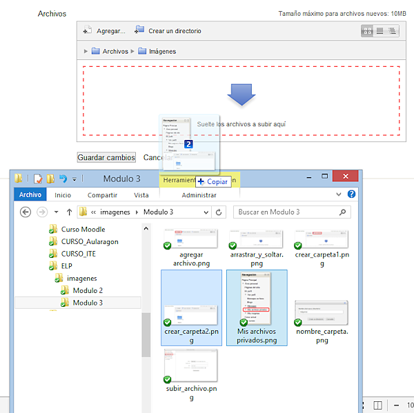

# Subir un archivo

Subir un archivo es una tarea muy sencilla.

Basta con pulsar en el botón "Agregar" del Selector de archivos:

**Fig. 3.7 Captura de pantalla. Selector de archivos.**

 

Al hacerlo aparece la ventana

**Fig. 3.8 Captura de pantalla. Selector de archivos.**

Hay que tener presente que el archivo se subirá a la carpeta que tengamos activa en ese momento. En el caso del ejemplo lo pondría en la raíz de los archivos de este tema o, si es la carpeta de Archivos privados, en la carpeta raíz. Si quisiéramos incluirla en la carpeta imágenes tendríamos que entrar previamente a la carpeta.

#### Arrastrar y soltar

Un sistema más sencillo para hacer todo esto es "Arrastrar y soltar". Si abrimos el explorador de archivos en nuestro equipo, no tendremos más que buscar en él los archivos que nos interesen, pinchar y sin soltar el botón del ratón, arrastrarlos hasta la ventana del selector de archivos, donde soltaremos.

**Fig. 3.9 Captura de pantalla del sistema arrastrar y soltar**

 

En el ejemplo de la imagen, se han seleccionado dos archivos y se están arrastrando hasta el área de archivos del selector de archivos de Moodle. Previamente hemos entrado en la carpeta Imágenes, para que se guarden en ella.

## Actividad 2: Subir un archivo

 

Sube un archivo en cada uno de los directorios que has creado.  Si puedes, sube archivos que vayas a utilizar más tarde en tu espacio educativo.

