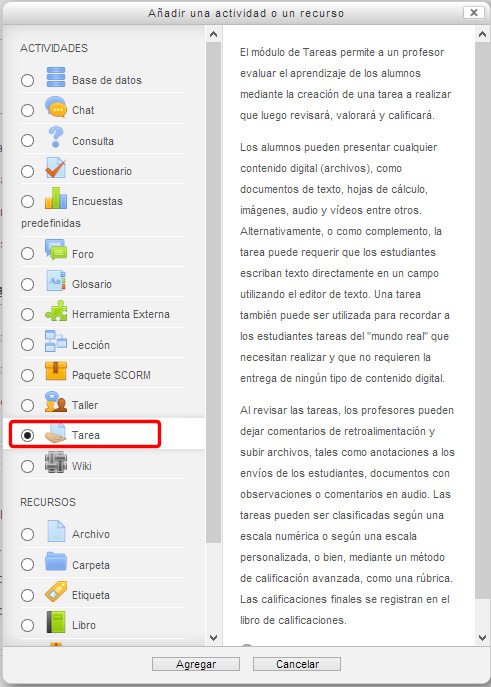

# Tareas

Dentro del módulo **Tarea **de Moodle existe la opción que permite a los usuarios subir archivos en distintos formatos y a los docentes calificarlos online.

Esta opción ofrece ventajas, como las siguientes, que facilitan y agilizan nuestra labor como docentes:

- Los alumno/as pueden subir sus tareas (en cualquier formato de archivo) al servidor.
- Se registra la fecha en que se han subido.
- Pueden enviar tareas fuera de tiempo, pero conoceremos la fecha de envío.
- Existe un único formulario que nos permite evaluar a la clase entera para cada actividad.
- Nuestras observaciones se adjuntan a la página de la tarea de cada estudiante.
- Se envía un mensaje de notificación a los alumno/as cuando comentamos sus tareas.
- Podemos permitir el reenvío de una tarea tras su calificación (para volver a calificarla).

### Tipos de tareas:

**Fig. 5.4 Captura de pantalla. Inserción de tarea.**

 

- ** Actividad no en línea:**

Este tipo de tarea es útil cuando el trabajo se realiza fuera de la plataforma y, además, lo deben realizar en un formato no electrónico como, por ejemplo, una lámina de dibujo. Los estudiantes pueden ver una descripción de la tarea, pero no pueden subir archivos. No obstante, los docentes pueden calificar a todos los estudiantes y los estudiantes recibirán notificaciones de sus calificaciones.

- ** Texto en línea:**

Permite al estudiante hacer uso del editor de texto HTML para escribir directamente la respuesta o solución al trabajo solicitado.

- **Subir archivos:**

En este caso, se permite que los estudiantes puedan subir uno o varios archivos de cualquier tipo. Éste podría ser un documento realizado con un procesador de textos, o una imagen, un sitio web comprimido o algo que se les ha pedido que envíen. El profesorado puede calificar en red las tareas remitidas.
