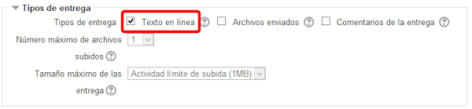
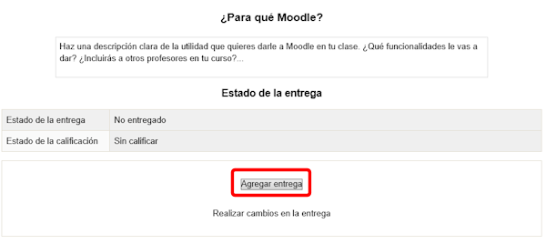
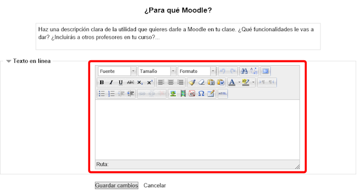

# Texto en línea

La inclusión de una tarea de texto en línea sigue el mismo proceso que el anterior tipo de tarea. La única diferencia está en qué es lo que pedimos alumno, que en este caso es un texto que ha de realizar sobre la plataforma. No sirve un texto hecho en un procesador externo ni una tarea que no sea de texto.

Igual que en el caso anterior, ponemos el título y la descripción clara de la tarea y marcamos la casilla "**Texto en línea**" del apartado **Tipos de entrega:**

**Fig. 5.7 Captura de pantalla. Tipos de entrega**

 

Vemos que no hemos marcado Archivos enviados porque en este tipo de tarea queremos un texto que se escriba sobre la plataforma del curso.

El alumno lo verá de la siguiente manera:

**Fig. 5.8 Captura de pantalla. Vista de tarea**

 

Ahí tiene la descripción de lo que se les pide y tienen también un botón Agregar entrega. Deben pinchar sobre él para que les aparezca el editro HTML en el que han de desarrollar el texto que se les pide.

**FIg. 5.9 Captura de pantalla. Vista de la entrega de tarea**

 

Terminarán pulsando en** Guardar cambios**.

El texto podrá modificarse mientras no se cumpla la fecha última de entrega.

El resto de opciones de la edición de una tarea son iguales en todas ellas y las describiremos después.

## Tarea1

Agrega en tu curso una tarea de texto en línea.

Recuerda que tus alumnos/as deberán escribir en el campo destinado a ello, dentro de la propia tarea, la solución a la cuestión planteada.
