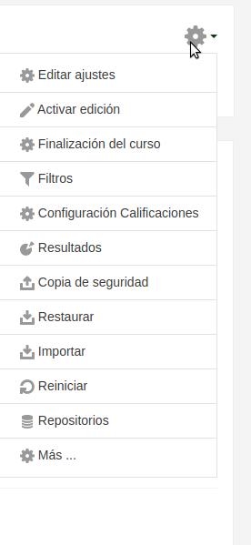
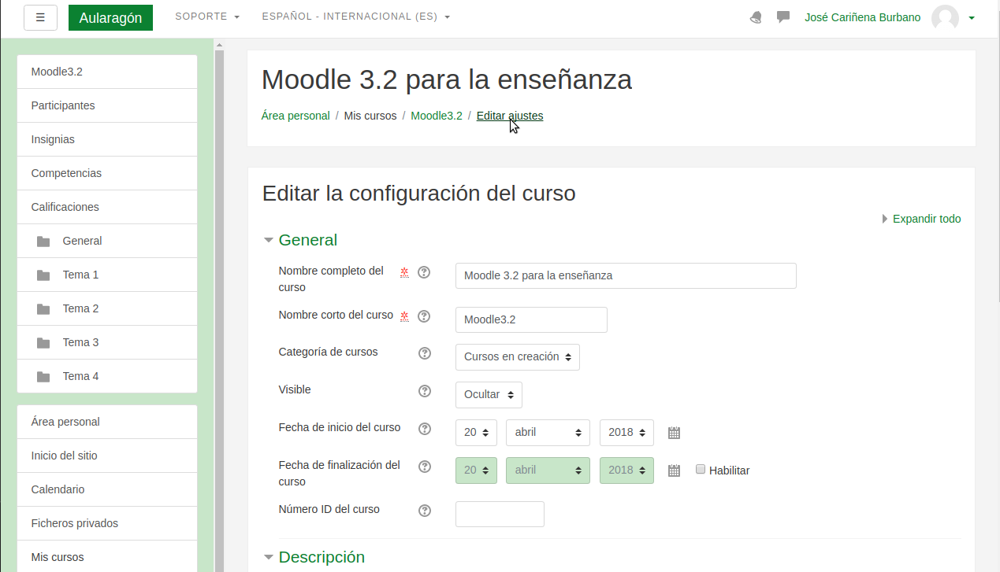

# El entorno de Moodle. Un poco de organización:

Seguro que has visto muchos cursos de Moodle con aspecto y apariencia de lo más variado, en cuanto a diseño y estética.

La apariencia de los cursos en Moodle viene determinada por una serie de parametros, fundamentalmente por el **formato**, los **temas** y por las **columnas** o secciones presentes en el área de trabajo del curso.

El **formato** y las características generales del curso se definen en la sección de **Editar ajustes** de un curso, al que se accede desde el icono de configuración en la parte superior izquierda de la página principal del curso:

El **tema** nos define el diseño estético del curso y se selecciona en la administración general de la plataforma Moodle en la que estemos trabajando.

